# .NET
---
## Descrição

É uma plataforma de desenvolvimento que utiliza a linguagem C# para desenvolvimento multiplataforma.

---
## Versões

* [Veja a linha do tempo do .NET](https://time.graphics/line/291016)
* Atualmente a plataforma .NET está em sua versão o [.NET 8](https://dotnet.microsoft.com/pt-br/download/dotnet/7.0)
* .NET Framework é a versão legada do .NET
---
## Classes

As classes são a estrutura mais básica de um projeto orientado a objeto. Ela parte da abstração que representa características de um objeto no mundo real

#### Exemplo de classe em .NET

| Sintaxe | Significado |
|---|---|
| `public class Pessoa` | Declaração de inicialização da classe dentro do projeto |
| `public string Nome { get; set; }` | Propriedade de inicialização de uma variável string dentro da classe |
| `{ get; set; }` | Define o comportamento desta variável na inicialização do objeto |
| `public void Apresentar()` | Método da classe
| `namespace ExemploFundamenos.Models` | Caminho lógico das classes dentro do projeto

#### namespaces
Os namespaces representam o caminho lógico da classe e deve ser declarado no código do programa para que as classes desenvolvidas possam ser utilizadas.

`using ExemploFundamentos.Models` vai definir o caminho lógico de onde as classes estão salvas para assim poderem ser usadas no software.

`Models` representa a pasta ou pacote em que a classe está salva.

---

## Tipos em C#

---

### Tabela de tipos

| Tipo | Representação | Valores suportados | Valor Padrão |
|---|---|---|---|
| string | Uma série de caracteres | --- | --- |
| char | Uma única caractere Unicode | --- | --- |
| object | Tipo objeto | --- | --- |
| bool | Valor booleano | True ou False | False |
| byte | Inteiro de 8-bit sem assinatura | 0 a 255 | 0 |
| decimal | Valores decimais na casa de 28-29 dígitos | (+ ou -)1.0 x 10e-28 até 10e28 | 0.0M |
| double | Valor flutuante de 64 bit com dupla precisão | (+/-)5.0 x 10 elevado a -324 até (+/-)1.7 x 10 elevado a 308 | 0.0M
| int | Valor inteiro de 32 bit | -2,147,483,648 até 2,147,483,647 | 0 |
| float | Valor de ponto flutuante 32 bit de unica precisão | -3.4 x 10 elevado a 38 até + 3.4 x 10 elevado a 38 | 0.0F |
| long | Valor inteiro 64 bit | -9,223,372,036,854,775,808 até 9,223,372,036,854,775,807 | 0L |
| uint | Valor inteiro 32 bit somente positivo | 0 até 4,294,967,295 | 0 |
| short | Valor inteiro 16 bit | -32,768 até 32,767 | 0 |
| ulong | Valor inteiro 64 bit somente positivo | 0 até 18,446,744,073,709,551,615 | 0 |

---

## Operadores em C#

---

### Tabela de operadores aritméticos

| Operador | Função |
|---|---|
| `=` | Atribuição |
| `+` | Soma ou concatena |
| `-` | Subtração |
| `*` | Multiplicação |
| `/`  | Divisão |
| `%` | Módulo (Resto da divisão)|
| `++` | Incremento |
| `--` | Decremento |
|---|---|---|
| `+=` | Mais igual |
| `+=` | mais igual |
| `-=` | menos igual |
| `*=` | vezes igual |
| `/=` | dividido igual |
| `%=` | módulo igual |

---

### Convertendo tipos

A conversão de tipos em C# é chamada de casting e existem duas maneiras principais de fazer está coversão. Qualquer tipo pode ser convertido e outro dentro da linguagem.

#### Convert

A classe `Convert.ToInt32("5")` possui métodos para conversão de tipos com tratamento de exceções. Podendo esta receber um valor `null` por exemplo e retornar `0`.

#### Parse

O método `int.Parse("5")` está presente dentro dos tipos e possui a função de converter valores de outros tipos no tipo em que o parse foi chamado. Este método não possui tratamento de exceções, o que leva a um erro ao ser passado um valor inesperado pelo método. Ao ser atribuido valor `null`, ocorrerá um erro e o programa será fechado.

#### Casting implicito

Alguns tipos suportam o casting implicito pois são tipos que cabem dentro de outro tipo. Como por exemplo o tipo `int` que pode caber dentro do `double` ou `long`, pois estes tipos suportam o tipo inteiro e casas decimais. O mesmo não pode acontecer ao contrário, pois o tipo `int` não suporta valores da ordem de valores `long` e `double`.

#### Convertendo de forma segura

Ao converter um valor de um tipo para outro é possível utilizar alguns métodos para tratar alguns erros. Como é o caso do método `.TryParse(a, out b);`, este método, diferente do `.Parse(a)`, vai tentar converter o valor da variável, mas caso este valor não possa ser convertido, o método retorna um valor definido pelo código `out VARIAVEL`.

---

### Tabela de operadores Condicionais

| Operador Relacional | Descrição |
|---|---|
| `==` |	Igual a |
| `!=` |	Diferente de |
| `>` |	Maior que |
| `<` |	Menor que |
| `>=` |	Maior do que ou igual a |
| `<=` |	Menor do que ou igual a |

### Tabela de operadores lógicos

|Operador Lógico |	Descrição |
|---|---|
| `&&` |	AND = E |
| `\|\|` |	OR = Ou |
| `!` |	NOT = Não |

---

## Estruturas Condicionais

### Estrutura if else
Estrutura de desvia o fluxo de execução de acordo com a condição.

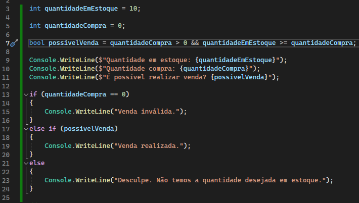

### Estrutura switch case
A estrutura switch case é recomendada para evitar estruturas if else aninhadas.

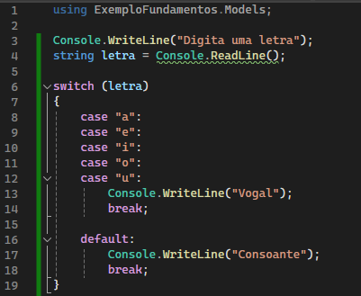

---

## Estruturas de Repetição

---

### Estrutura de repetição For
O laço de repetição for é composto por uma variável contadora, uma condicional e uma ação. Ao satisfazer a condição o laço é interrompido.

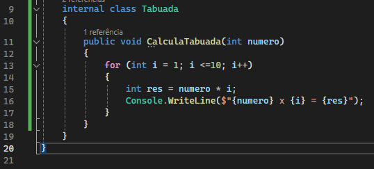

### Estrutura de repetição Foreach
A estrutura de repetição foreach funciona de maneira semelhante com a estrutura for, porém, não temos acesso a um contador. Caso seja necessário o uso de um contador, é preciso declarar uma variável contadora.
A estrutura percorre o array e para cada posição dele, a variável `valor` recebe o valor contido na posição.

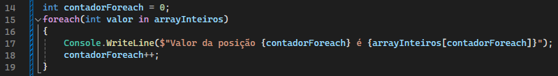

### Estrutura de repetição While
A estrutura while funciona de forma parecida com o laço for, mas com variáveis do ambiente.

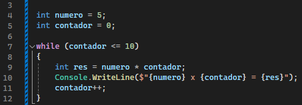

### Estrutura de repetição Do While
A estrurura do while, funciona de forma parecida com a estrutura while, mas ela garante que pelo menos uma execução do código seja feita.

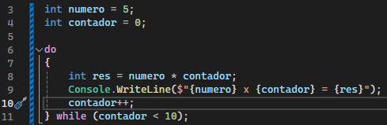

---

## Arrays e Listas em C#

---

### Arrays

Estrutura de dados que armazena valores do mesmo tipo, com um tamanho fixo.

#### Criando um Array
Arrays podem ser instanciados assim como objetos. Também possuem métodos como `arrayInteiros.Length` que da o tamanho do array.
##### Array de Inteiros com 3 posições
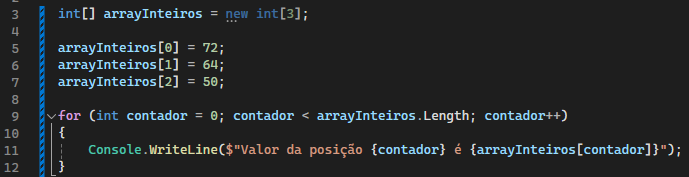

#### Redimensionando um Array
Quando um Array é instanciado, não é mais possível alterar o seu tamanho.
Somente com o auxilio da classe `Array` que é possivel redimensionar este array quando o programa já está rodando.

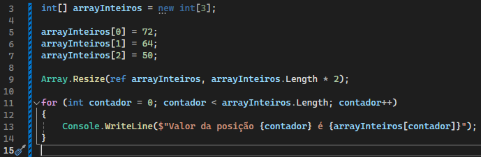
Neste exemplo, o array tem a sua dimensão dobrada pelo método `Array.Resize()` que recebe dois parâmetros:
1. O Array de referência `ref arrayInteiros`
2. A operação que será feita no tamanho `arraiInteiros.Length * 2`

#### Copiando um Array para outro
O método `Array.Copy` possibilita a cópia de um array para outro.

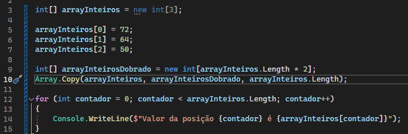
Neste exemplo, é criando um novo array com o tamanho do antigo array dobrado.
O método `Array.Copy` recebe os seguintes parametros:
1. O array de origem `arrayInteiros`
2. O array de destino `arrayInteirosDobrado`
3. A quantidade de elementos do array de origem que serão copiados `arrayInteiros.length`
*Este parametro está recebendo o tamanho do array antigo, ou seja, vai copiar o array inteiro*

---

### Listas
As listas funcionam de forma parecida com os arrays, mas possuem métodos mais complexos e sua capacidade pode variar de tamanho.

#### Criando uma lista e Adicionando elementos

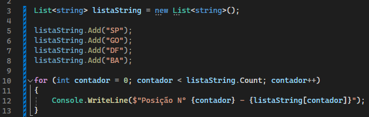
No exemplo acima, criamos uma lista sem passar um parametro de tamanho.
O método `.Add()` adiciona um novo elemento a lista e incrementa seu tamanho.
Ao final, o loop for recebe o método `.Count` que funciona como o método `.Length` dos arrays.

#### Removendo elementos

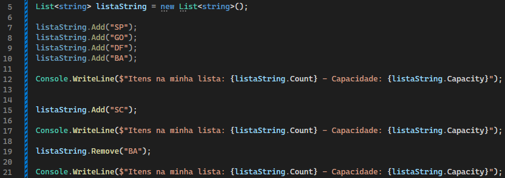
As listas trabalham internamente com um array, mas não precisamos nos preocupar com a capacidade deste array.
As listas automaticamente alteram o sua capacidade.
