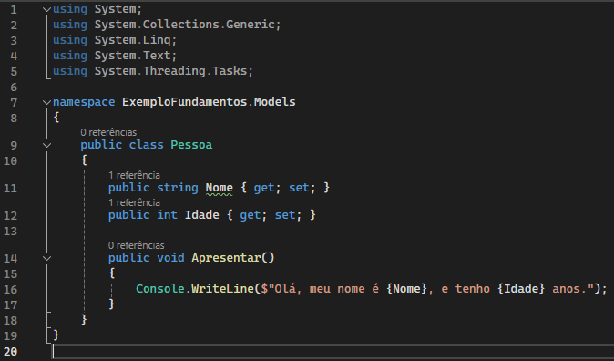

# .NET
É uma plataforma de desenvolvimento que utiliza a linguagem C# para desenvolvimento multiplataforma.

## Versões
* [Veja a linha do tempo do .NET](https://time.graphics/line/291016)
* Atualmente a plataforma .NET está em sua versão o [.NET 8](https://dotnet.microsoft.com/pt-br/download/dotnet/7.0)
* .NET Framework é a versão legada do .NET

## Classes
As classes são a estrutura mais básica de um projeto orientado a objeto. Ela parte da abstração que representa características de um objeto no mundo real

#### Exemplo de classe em .NET

| Sintaxe | Significado |
|---|---|
| `public class Pessoa` | Declaração de inicialização da classe dentro do projeto |
| `public string Nome { get; set; }` | Propriedade de inicialização de uma variável string dentro da classe |
| `{ get; set; }` | Define o comportamento desta variável na inicialização do objeto |
| `public void Apresentar()` | Método da classe
| `namespace ExemploFundamenos.Models` | Caminho lógico das classes dentro do projeto

#### namespaces
Os namespaces representam o caminho lógico da classe e deve ser declarado no código do programa para que as classes desenvolvidas possam ser utilizadas.

`using ExemploFundamentos.Models` vai definir o caminho lógico de onde as classes estão salvas para assim poderem ser usadas no software.

`Models` representa a pasta ou pacote em que a classe está salva.

#### Tipos em C#

__*Tabela de tipos*__

| Tipo | Representação | Valores suportados | Valor Padrão |
|---|---|---|---|
| string | Uma série de caracteres | --- | --- |
| char | Uma única caractere Unicode | --- | --- |
| object | Tipo objeto | --- | --- |
| bool | Valor booleano | True ou False | False |
| byte | Inteiro de 8-bit sem assinatura | 0 a 255 | 0 |
| decimal | Valores decimais na casa de 28-29 dígitos | (+ ou -)1.0 x 10e-28 até 10e28 | 0.0M |
| double | Valor flutuante de 64 bit com dupla precisão | (+/-)5.0 x 10 elevado a -324 até (+/-)1.7 x 10 elevado a 308 | 0.0M
| int | Valor inteiro de 32 bit | -2,147,483,648 até 2,147,483,647 | 0 |
| float | Valor de ponto flutuante 32 bit de unica precisão | -3.4 x 10 elevado a 38 até + 3.4 x 10 elevado a 38 | 0.0F |
| long | Valor inteiro 64 bit | -9,223,372,036,854,775,808 até 9,223,372,036,854,775,807 | 0L |
| uint | Valor inteiro 32 bit somente positivo | 0 até 4,294,967,295 | 0 |
| short | Valor inteiro 16 bit | -32,768 até 32,767 | 0 |
| ulong | Valor inteiro 64 bit somente positivo | 0 até 18,446,744,073,709,551,615 | 0 |

#### Operadores em c#

* __*Tabela de operadores aritméticos*__

| Operador | Função |
|---|---|
| `=` | Atribuir valor a uma variável |
| `+` | Soma ou concatena dois valores ou variáveis |
| `-` | Subtrai dois valores |
| `+=` | Soma a variavel mais um valor. Equivale a `c = c + 5`|
| `-=` 

* __*Convertendo tipos*__

A conversão de tipos em C# é chamada de casting e existem duas maneiras principais de fazer está coversão. Qualquer tipo pode ser convertido e outro dentro da linguagem.

__Convert__

A classe `Convert.ToInt32("5")` possui métodos para conversão de tipos com tratamento de exceções. Podendo esta receber um valor `null` por exemplo e retornar `0`.

__Parse__

O método `int.Parse("5")` está presente dentro dos tipos e possui a função de converter valores de outros tipos no tipo em que o parse foi chamado. Este método não possui tratamento de exceções, o que leva a um erro ao ser passado um valor inesperado pelo método. Ao ser atribuido valor `null`, ocorrerá um erro e o programa será fechado.

__Casting implicito__

Alguns tipos suportam o casting implicito pois são tipos que cabem dentro de outro tipo. Como por exemplo o tipo `int` que pode caber dentro do `double` ou `long`, pois estes tipos suportam o tipo inteiro e casas decimais. O mesmo não pode acontecer ao contrário, pois o tipo `int` não suporta valores da ordem de valores `long` e `double`.

__Convertendo de forma segura__

Ao converter um valor de um tipo para outro é possível utilizar alguns métodos para tratar alguns erros. Como é o caso do método `.TryParse(a, out b);`, este método, diferente do `.Parse(a)`, vai tentar converter o valor da variável, mas caso este valor não possa ser convertido, o método retorna um valor definido pelo código `out VARIAVEL`.
