# Manipulação de Dados e Objetos com .NET

---

## Propriedades
As propriedades estão relacionada a abstração de valores para ler, gravar ou calcular valores de campos. 
Propriedades ajudam de maneira flexivel que as classes tenham tratamento de erros, evitando que o usuário insira dados inesperados para a operação.

### Propriedades de uma classe

No exemplo acima, a classe Pessoa possui duas propriedades, Nome e Idade seguidas de `{ get; set; }` após a declaração.

### Modificadores de acesso
Os modificadores de acesso, são palavras reservadas que definem o acesso a propriedades, variáveis e métodos de uma classe.
Eles são para quando você precisa que a propriedade seja validada antes de ser atribuida. Uma variável privada só pode ser modificada por propriedades de dentro da classe, ou seja, somente após ela passar pela validação.

#### Tabela de modificadores de acesso

|Modificador|Função|
|---|---|
|`public`|Pode ser acessado por qualquer um do projeto ou fora dele|
|`private`|Só pode ser acessado pelo método ou classe de mesmo escopo|

### Validações GET e SET
As validações servem para evitar que sejam passados valores inesperados para uma variável.

#### Criando uma validação

Para que uma validação seja feita, é preciso a declaração de uma variável *__privada__* do mesmo *__tipo__* da propriedade.
Dentro da propriedade __*Nome*__ será declarada as validações necessárias e a propriedade atribuirá o valor á variável privada `_nome`.

#### Validação GET

O exemplo acima indica que a propriedade __*Nome*__ receberá sempre os valores em maiúsculo por meio do método `.ToUpper()`.
Portanto todo valor recebido por essa propriedade passará por um tratamento antes de ser setado.

Uma propriedade pode ter somente `get` ou somente `set` e no caso de ter somente o `get`, podemos utilizar uma body expression para que esta retorne um valor concatenado como na propriedade `NomeCompleto` acima.

Quando uma propriedade possui somente uma validação `get` esta não pode ser setada de fora da classe. Então se você tentar setar um `NomeCompleto`, vai ocorrer um erro pois o mesmo só possui uma validação `get`.

#### Validação SET

O exemplo acima indica que a propriedade __*Nome*__ não pode atribuir uma string vazia, caso receba, a palavra reservada `throw` vai exibir uma mensagem de erro por meio da classe `ArgumentException()` e não vai executar o restante do código.

#### Body Expressions

Quando temos uma validação muito simples, como o `return _nome.ToUpper()`, podemos utilizar uma body expression para simplificar mais ainda a leitura do código. Assim substituindo um bloco de código pelo símbolo `=>`.

No exemplo acima, uma body expression foi utilizada para apenas atribuir o valor, dispensando a utilização do bloco e a palavra reservada `return`. Por outro lado, no método set não é possível a utilização de body expression, pois o mesmo faz uso de uma condicional if-else e necessita de um bloco.

---

## Métodos

Os métodos são ações que a classe pode executar. Nada mais são que outra forma de escrever uma função. Métodos auxiliam principalmente em reduzir drasticamente a repetição de um código.
Se seu programa tem muita reptição de código, considere criar um método para ele.

Os métodos de uma classe podem ser públicos ou privados dela.

### Assinatura de método

Todo método pode ser identificado por sua assinatura representado no exemplo por `void AdicionarAluno(Pessoa aluno)`. Consiste em `void` sendo o tipo de retorno, `AdicionarAluno` sendo o nome do método e `(Pessoa aluno)` sendo seus argumentos.
Mesmo que um método não possua argumentos os `()` são obrigatórios na declaração de um método.

### Tipos de retorno
Os tipos de retorno definem o que aquele método deve retornar ou até mesmo se ele não deve retornar nada.

#### Método sem retorno

Os métodos sem retorno são caracterizados pela palavra reservada `void`. Métodos sem retorno são metodos que realizam uma ação e não retornam valor algum.

#### Método com retorno

Os métodos com retorno são caracterizados pelo tipo de retorno após o modificador de acesso. Ele pode ser qualquer tipo da linguagem C#, como `string`, `int`, Valores retornado por outros metodos, etc.

---

## Construtores
Os construtores possibilitam que a classe receba os valores no momento de sua instanciação.

No exemplo acima, podemos ver que ao invés de declarar e atribuir as propriedades `.Nome` e `.Sobrenome`, elas passam a ser declaradas como argumento em sua instanciação.

### Criando um construtor

Um construtor, por convenção, é sempre declarado logo abaixo da classe e deve obrigatoriamente possuir o mesmo nome da classe. Sua sintaxe se assemelha a sintaxe de uma função, com seus argumentos sendo inseridos dentro de `()`.

### Construtor com argumentos

Os argumentos de um construtor são declarados com seu tipo e nome de utilização.
Caso os parametros não sejam declarados no momento de sua instanciação, ocorrerá um erro. Para evitar isto, um construtor de mesmo nome e sem argumentos deve ser criado.
Portanto a classe pode ser declarada com argumentos ou não neste caso.

---

## Manipulando valores
A manipulação de valores acontece em todo programa de computador e devem ser levado em consideração alguns casos para que não ocorram erros ou bugs no código.

### Concatenação
Quando se trata de strings, o operador aritmético `+` não faz mais uma operação de soma, como é esperado numa operação entre variáveis do tipo `int` por exemplo.

No exemplo acima, o operador vai apenas concatenar as strings e variáveis numa única variável. Dando como resultado um único texto.

### Interpolação
A interpolação facilita o entendimento do código por meio da concatenação dentro da string. Toda interpolação deve começar com o símbolo `$`.

Note que as variáveis agora estão dentro da string separadas por `{}` do restante da string.

### Formatando valores monetários
Podemos utilizar uma formatação para valores monetários sem que seja necessário escrever `R$` dentro da string por meio da interpolação. Para que seja feita a formatação monetária, é necessário utilizar `:C` após a variável dentro das `{}`.

O `:C` representa a palavra currecy que significa moeda. Esta formatação vai automaticamente coletar a informação de região do sistema, portanto vai formatar de acordo com a moeda da região do sistema.

#### Formatação monetária de outra região
Caso seja necessário outra formatação monetária, é possível utilizar a biblioteca `System.Globalization`, com ela podemos utilizar a classe `CultureInfo.DefaultThreadCurrentCulture` para alterar a cultura do sistema para que receba valores personalizados.

No exemplo acima a classe recebe um `new CultureInfo("en-US")` que formata o valor de acordo com a moeda dos Estados Unidos.

__*Este método deve ser utilizado com cautela, pois o mesmo vai setar o valor em toda a execução do programa.*__

Caso seja necessário a formatação em apenas uma parte do sistema, é possível utilizar a formatação no método `.ToString`.

### Formatação personalizada
É possível determinar uma formatação personalizada, caso precise que o número seja formatado com 2 casas decimais ou porcentagem por exemplo.

Neste exemplo, a saída será `12-34-56`.

#### Formatando casas decimais

Neste exemplo, terá uma formatação de número com apenas uma casa decimal.

#### Formatando porcentagem

Neste exemplo, a saída formatada será `34,21%`

### Formatação do tipo DateTime
A classe `DateTime` é responsável por capturar a data e hora atual do sistema. Ela é muito útil para trabalhos que precisam de informação de data e hora, como em um banco de dados.

No exemplo acima, será capturada a data e hora completa no momento da execução do programa.

#### Formatando data e hora

No exemplo acima, será feita a formatação padrão brasileira dispensando os segundos. Haverá diferença entre letras maiúsculas e minúsculas, como no caso de `MM` e `mm`, onde um representa mês e o outro minutos.

#### Somente data ou hora

Podemos também obter somente a data ou somente a hora pelos métodos `.ToShortDateString()` e `.ToShortTimeString()`.

#### Conversões no DateTime

Nem sempre temos a nossa disposição a data e hora do sistema. Para isso podemos utilizar a conversão de string para o tipo DateTime.

##### Parse

Neste caso estamos passando uma string que será convertida em DateTime.
Caso a data não seja válida, a classe vai apresentar um erro e o programa será encerrado.

##### TryParse

Podemos utilizar o método `.TryParseExact` para controlar melhor a formatação de datas para que não ocorra um erro caso seja passada uma data inválida.

Neste caso, estamos passando uma data inválida com o mês 13.
O método `.TryParseExact` recebe 5 parâmetros:
1. `dataString` - A variável que será formatada
2. `yyyy-MM-dd HH:mm` - Como será a formatação
3. `CultureInfo.InvariantCulture` - A cultura de sistema
4. `DateTimeStyles.None` - O estilo do DateTime
5. `out DateTime data` - A variável de saída

Neste caso a saída será `01/01/0001 00:00:00` pois passamos um mês inválido, mas não ocorrerá um erro.

##### Validando o TryParse
O método `.TryParseExact` retorna um valor booleano, com isso podemos validar se o valor foi convertido ou não.

---

## Exceções

Os recursos de manipulação de exceção ajudam você a lidar com quaisquer situações excepcionais ou inesperadas que ocorram quando um programa for executado.

### Realizando leitura de um arquivo

A classe `File` permite a leitura de arquivos através do endereço deles. Pode ser inserido como argumento o caminho completo do arquivo ou somente o arquivo a partir do programa.

No exemplo acima é necessário utilizar o `../../../` pois o os arquivos de solução no visual studio são carregados a partir da pasta `bin/Debug/net6.0/`. Portanto é necessário que voltemos o caminho para a pasta do projeto.

### Disparando e tratando uma exceção

Nem sempre temos o caminho do arquivo bem escrito como no tópico acima, quando acontece, o programa dispara uma excessão e se encerra. Alguns códigos de erro serão impressos no terminal dando uma pista para que o desenvolvedor investigue onde está ocorrendo o erro.

Para que não ocorra uma exceção e o programa continue sua execução, podemos utilizar o bloco `try` e caso o código dentro do bloco não seja executado corretamente, o bloco `catch` vai pegar uma exceção e exibir a mensagem definida pelo desenvolvedor.
A classe `Exception` captura as excessões ocorridas e as armazena na variável `ex`. A expressão `ex.Message` exibe uma mensagem genérica desta exceção que ocorreu e exibe no terminal.

### Exceção genérica e específica

#### Genérica

O método `.ReadAllLines` retorna várias exceções genéricas, onde erros comumente encontrados já estão prontos e retornam exceções como `Could not find file` ou `Could not find a part of the path` por exemplo.
Um bloco de exceção `catch` genérico pode ser excrito para capturar qualquer mensagem de erro que o desenvolvedor não esteja esperando e não interromper a execução do programa.

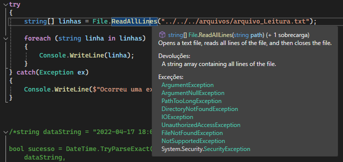

#### Específica

As exceções específicas ocorrem quando já conhecemos o erro e podemos atribuir mensagens específicas para o erro. Os blocos `catch` são utilizados para escrever o código dos erros específicos que o desenvolvedor quer tratar e possibilitar que o programa continue executando.
É possível escrever quantos blocos `catch` forem necessários.

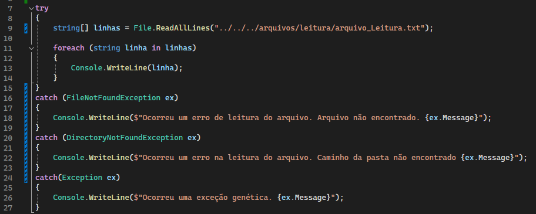
A exceção específica é definida pelo tipo de exceção que será capturada `FileNotFoundException` e a variável onde a mensagem de erro será armazenada `ex`.

#### Bloco finally

Muitas vezes se faz necessária uma ação independetende de ter ocorrido um erro ou não. O bloco `finally` é utilizado para que executemos um bloco de código mesmo que não ocorra nenhuma excessão.

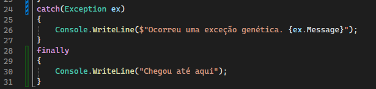
O bloco finally se faz necessário para fechar uma conexão com o banco de dados por exemplo.

### Exceção Throw

A exceção Throw é utilizada para capturar e jogar uma exceção para cima, ou seja, vai ocorrer uma exceção inesperada e sejá jogada para o último bloco de código executado. Caso o bloco acima tenha um tratamento de exceção catch, o throw utilizará este tratamento, auxiliando no reaproveitamento de código.

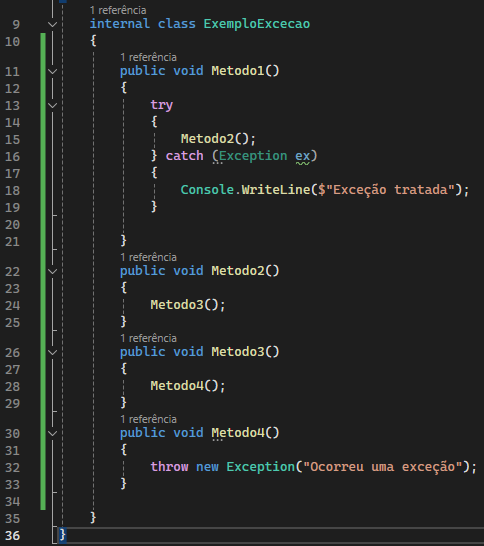
No exemplo acima, o `Método4()` é o último a ser executado, ocorrendo uma exceção, esta será jogada para o `Metodo3()`, que caso tiver um `catch`, este erro será tratado de acordo com o bloco. Neste caso vai para o `metodo2()` e somente no `metodo1()` esta exceção é tratada.

---

## Coleções

As coleções de elementos com diferentes comportamentos dependendo de seu tipo.

### Filas

As filas são arrays do tipo `Queue` que obedece a ordem FIFO (First in First out), que seu comportamento consiste no primeiro elemento a entrar é o primeiro a sair. Funcionando como uma fila de banco, por exemplo. O primeiro dado a ser recebido pela fila será o primeiro a ser processado e assim sucessivamente.

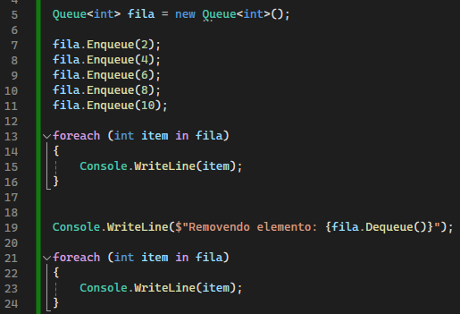
No exemplo acima foram adicionado 5 elementos inteiros a uma fila com o método `.Enqueue()` criado pela classe `Queue`.
Na linha 19 o primeiro elemento que entrou é removido, neste caso o elemento 2 adicionado na linha 7. Note que o método `.Dequeue()` não pussui parâmetro. Isso ocorre pelo comportamento da fila.

### Pilhas

As pilhas, ao contrário das filas, são arrays do tipo `Stack` que obedece a ordem LIFO (Last in First out), que seu comportamento consiste no primeiro a entrar é o último a sair. Funcionando como uma pilha de livros, por exemplo. Sempre será processado o dado de cima da pilha.

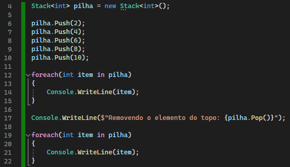
No exemplo acima também são adicionados 5 elementos com o método `.Push()`. Na linha 17 o último elemento a ser adicionado é removido com o método `.Pop()`, neste caso o último elemento a ser adicionado é o número 10.

### Dicionários

Os dicionários são uma coleção de pares chave-valor para armazenar valores únicos sem uma ordem específica.
A classe `Dictionary` cria um conjunto de elementos de qualquer tipo que não seguem uma ordem específica e cada elemento dentro deste array é único.

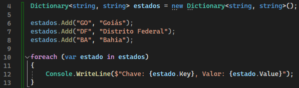
No exemplo acima temos 3 pares de chave valor com o método `.Add()` sendo eles 3 estados do Brasil e suas siglas como chave.
Não é possível adicionar uma chave que já exista dentro do dicionário.

#### Removendo elementos

Podemos remover elementos pela sua chave utilizando o método `.Remove()`.

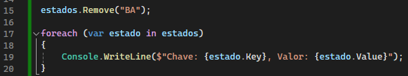
No exemplo acima removemos o elemento `"BA"` do dicionário

#### Alterando elementos

Para alterar um elemento existente, precisados da chave do elemento e utilizaremos ela como um índice de array.

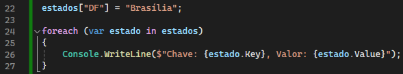
No exemplo acima alteramos o valor da chave `"DF"`.

#### Verificando chave existente

Podemos verificar se a chave que queremos adicionar já existe no dicionário.

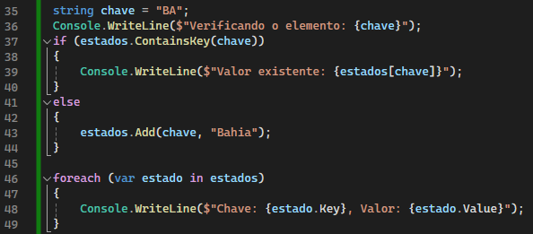
No exemplo acima recebemos uma variável string `chave`, que passa por uma verificação no método `.ContainsKey()` do dicionário. Caso o valor já exista no dicionário, será exibida a mensagem da linha 39, caso não, o valor `"Bahia"` será adicionado com a chave determinada anteriormente.

---

## Tuplas, Operador ternário e Desconstrução de Objeto

Tuplas fornece sintaxe concisa para agrupar vários elementos de dados em uma estrutura de dados leve. Uma tupla funciona de forma parecida com as coleções, mas porem carregar em si diferentes tipos de dados

### Sintaxe de uma tupla

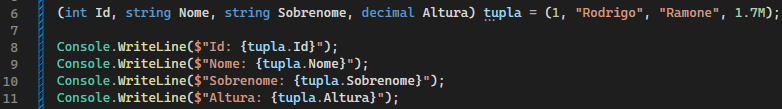
Como podemos ver no exemplo acima, a tupla primeiro recebe os parâmetros de tipo, é declarada como qualquer outra variável e recebe os valores na mesma sequência de tipos.

### Tuplas em métodos

Suponhamos que temos um método que precisa retornar mais de um valor. Utilizando a tupla isso é possível.

No exemplo acima temos um método `LerArquivo()` que retorna 3 valores `bool, string, int`. O retorno em tupla sempre deve ser na mesma sequencia em que o retorno de método foi declarado.

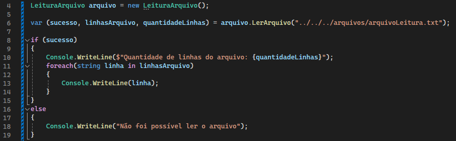
Na prática o retorno em tupla precisa de 3 variáveis para recebe-los, podemos utilizar a palavra reservada `var` para que o próprio C# identifique que tipo de variável está sendo retornada e assim declarar seus nomes.

### Descartes

Podemos descartar informações desnecessárias caso um método com retorno em tupla seja chamado.

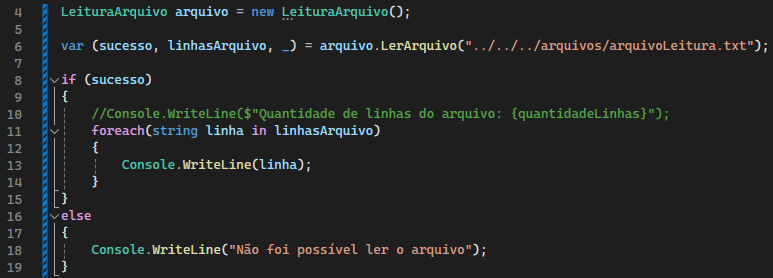
Caso um alguma informação do retorno em tupla não seja necessária no programa, podemos utilizar o `_` neste retorno para que este seja descartado.

### Desconstrutor

O desconstrutor funciona de forma inversa ao construtor de uma classe.

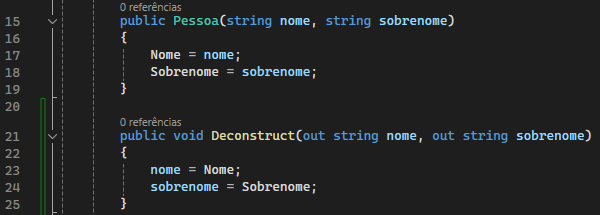
Podemos observar que diferente do construtor `Pessoa()`, o `Deconstruct()` recebe as propriedades de Nome e Sobrenome da classe `Pessoa` e as armazena em variáveis de saída. Fazendo a operação inversa ao construtor da classe.

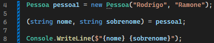
Ná prática, o descontrutor declarado dentro da classe possibilita o retorno de uma tupla, armazenando duas variáveis do tipo string `nome` e `sobrenome` separadamente do objeto instanciado.

### Operador ternário

Para casos mais simples de validações If-Else, podemos utilizar o operador ternário para melhorar a legibilidade do código.

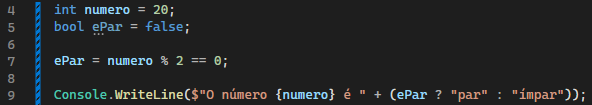
No exemplo acima, declaramos uma variável booleana `ePar` que receberá um teste lógico `numero % 2 == 0` para verificar se o número é par ou ímpar. O operador ternário fará a validação se essa condição é `true` ou `false` por meio da expressão `ePar ? "par" : "ímpar"`, dispensando o uso de blocos If-Else e melhorando a legibilidade do código.

---

## Nuget, Serializar e Atributos

__O que é um pacote?__
Um pacote é um conjunto de códigos úteis, que possibilita o compartilhamento e reuso de código.

### Nuget
Nuget é um gerenciador de pacotes para .NET que auxiliam o desenvolvedor com pacotes de códigos prontos para fazer determinadas funções que algum outro desenvolvedor já escreveu.
[Pacotes Nuget](https://www.nuget.org/)

#### Instalando pacotes

##### Visual Studio
No Visual Studio podemos instalar por meio do gerenciador de pacotes da própria IDE:

###### Gerenciar Pacotes NuGet

1. Clique com o botão direito no .cjproj
2. Clique em Gerenciar Pacotes do NuGet

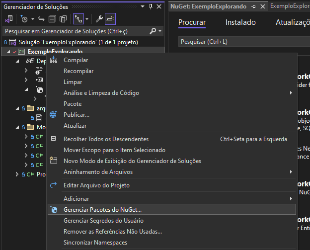

1. Clique na aba Procurar
2. Selecione o pacote que deseja baixar

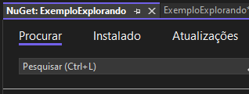

1. Clique em instalar

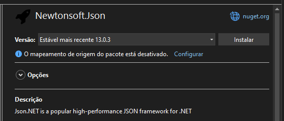

###### Console Gerenciador de Pacotes

1. Clique na Aba Exibir
2. Vá até Outras Janelas
3. Clique em Console do Gerenciador de Pacotes

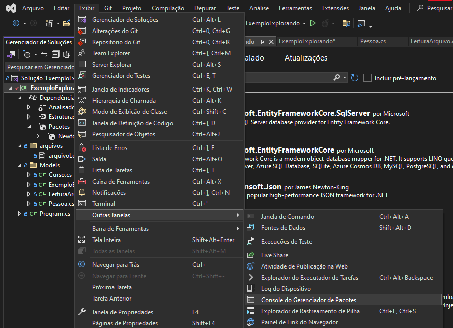

1. Econtre o link do pacote que deseja baixar
2. Vá até a aba Package Manager
3. Copie o comando para o Package Manager
4. Cole no Console Gerenciador de Pacotes
5. Pressione ENTER

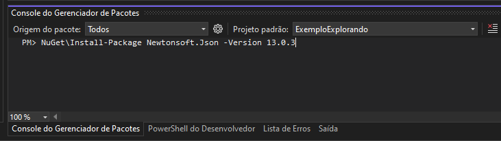

#### Serialização de dados

A serialização consiste em transformar objetos de um programa em bytes para que possam persistir em algum tipo de arquivo, espaço na memória ou banco de dados.

##### JSON
JavaScript Notation Object é um formato de texto que segue a sintaxe Javascript, muito usado para transmitir dados entre aplicações.

    {
        "id": 1,
        "Produto": "P1",
        "Preco": 10.50
    }

##### Pacote Newtonsoft

O pacote Newtonsoft é um dos mais utilizados no mundo para transformar objetos em formato `.json`.

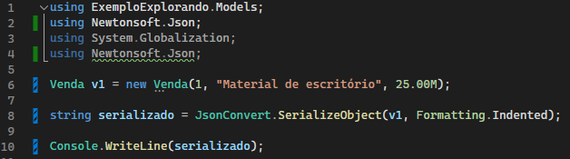
Digitando `using Newtonsoft.Json` podemos então utilizar a classe `JsonConvert` que possui o método `.SerializeObject` que serializa um objeto intanciado dentro do programa.
O método recebe o primeiro parâmetro que será o objeto a ser serializado e possui sobrecarga para formatação `Formatting.Idented`.