# Manipulação de Dados e Objetos com .NET

---

## Propriedades
As propriedades estão relacionada a abstração de valores para ler, gravar ou calcular valores de campos. 
Propriedades ajudam de maneira flexivel que as classes tenham tratamento de erros, evitando que o usuário insira dados inesperados para a operação.

### Propriedades de uma classe

No exemplo acima, a classe Pessoa possui duas propriedades, Nome e Idade seguidas de `{ get; set; }` após a declaração.

### Modificadores de acesso
Os modificadores de acesso, são palavras reservadas que definem o acesso a propriedades, variáveis e métodos de uma classe.
Eles são para quando você precisa que a propriedade seja validada antes de ser atribuida. Uma variável privada só pode ser modificada por propriedades de dentro da classe, ou seja, somente após ela passar pela validação.

#### Tabela de modificadores de acesso

|Modificador|Função|
|---|---|
|`public`|Pode ser acessado por qualquer um do projeto ou fora dele|
|`private`|Só pode ser acessado pelo método ou classe de mesmo escopo|

### Validações GET e SET
As validações servem para evitar que sejam passados valores inesperados para uma variável.

#### Criando uma validação

Para que uma validação seja feita, é preciso a declaração de uma variável *__privada__* do mesmo *__tipo__* da propriedade.
Dentro da propriedade __*Nome*__ será declarada as validações necessárias e a propriedade atribuirá o valor á variável privada `_nome`.

#### Validação GET

O exemplo acima indica que a propriedade __*Nome*__ receberá sempre os valores em maiúsculo por meio do método `.ToUpper()`.
Portanto todo valor recebido por essa propriedade passará por um tratamento antes de ser setado.

Uma propriedade pode ter somente `get` ou somente `set` e no caso de ter somente o `get`, podemos utilizar uma body expression para que esta retorne um valor concatenado como na propriedade `NomeCompleto` acima.

Quando uma propriedade possui somente uma validação `get` esta não pode ser setada de fora da classe. Então se você tentar setar um `NomeCompleto`, vai ocorrer um erro pois o mesmo só possui uma validação `get`.

#### Validação SET

O exemplo acima indica que a propriedade __*Nome*__ não pode atribuir uma string vazia, caso receba, a palavra reservada `throw` vai exibir uma mensagem de erro por meio da classe `ArgumentException()` e não vai executar o restante do código.

#### Body Expressions

Quando temos uma validação muito simples, como o `return _nome.ToUpper()`, podemos utilizar uma body expression para simplificar mais ainda a leitura do código. Assim substituindo um bloco de código pelo símbolo `=>`.

No exemplo acima, uma body expression foi utilizada para apenas atribuir o valor, dispensando a utilização do bloco e a palavra reservada `return`. Por outro lado, no método set não é possível a utilização de body expression, pois o mesmo faz uso de uma condicional if-else e necessita de um bloco.

---

## Métodos

Os métodos são ações que a classe pode executar. Nada mais são que outra forma de escrever uma função. Métodos auxiliam principalmente em reduzir drasticamente a repetição de um código.
Se seu programa tem muita reptição de código, considere criar um método para ele.

Os métodos de uma classe podem ser públicos ou privados dela.

### Assinatura de método

Todo método pode ser identificado por sua assinatura representado no exemplo por `void AdicionarAluno(Pessoa aluno)`. Consiste em `void` sendo o tipo de retorno, `AdicionarAluno` sendo o nome do método e `(Pessoa aluno)` sendo seus argumentos.
Mesmo que um método não possua argumentos os `()` são obrigatórios na declaração de um método.

### Tipos de retorno
Os tipos de retorno definem o que aquele método deve retornar ou até mesmo se ele não deve retornar nada.

#### Método sem retorno

Os métodos sem retorno são caracterizados pela palavra reservada `void`. Métodos sem retorno são metodos que realizam uma ação e não retornam valor algum.

#### Método com retorno

Os métodos com retorno são caracterizados pelo tipo de retorno após o modificador de acesso. Ele pode ser qualquer tipo da linguagem C#, como `string`, `int`, Valores retornado por outros metodos, etc.

---

## Construtores
Os construtores possibilitam que a classe receba os valores no momento de sua instanciação.

No exemplo acima, podemos ver que ao invés de declarar e atribuir as propriedades `.Nome` e `.Sobrenome`, elas passam a ser declaradas como argumento em sua instanciação.

### Criando um construtor

Um construtor, por convenção, é sempre declarado logo abaixo da classe e deve obrigatoriamente possuir o mesmo nome da classe. Sua sintaxe se assemelha a sintaxe de uma função, com seus argumentos sendo inseridos dentro de `()`.

### Construtor com argumentos

Os argumentos de um construtor são declarados com seu tipo e nome de utilização.
Caso os parametros não sejam declarados no momento de sua instanciação, ocorrerá um erro. Para evitar isto, um construtor de mesmo nome e sem argumentos deve ser criado.
Portanto a classe pode ser declarada com argumentos ou não neste caso.

---

## Manipulando valores
A manipulação de valores acontece em todo programa de computador e devem ser levado em consideração alguns casos para que não ocorram erros ou bugs no código.

### Concatenação
Quando se trata de strings, o operador aritmético `+` não faz mais uma operação de soma, como é esperado numa operação entre variáveis do tipo `int` por exemplo.

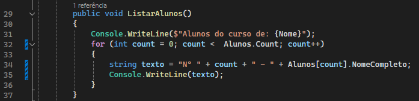
No exemplo acima, o operador vai apenas concatenar as strings e variáveis numa única variável. Dando como resultado um único texto.

### Interpolação
A interpolação facilita o entendimento do código por meio da concatenação dentro da string. Toda interpolação deve começar com o símbolo `$`.

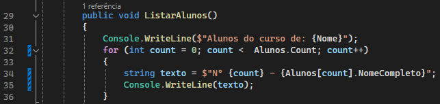
Note que as variáveis agora estão dentro da string separadas por `{}` do restante da string.

### Formatando valores monetários
Podemos utilizar uma formatação para valores monetários sem que seja necessário escrever `R$` dentro da string por meio da interpolação. Para que seja feita a formatação monetária, é necessário utilizar `:C` após a variável dentro das `{}`.

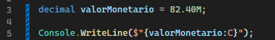
O `:C` representa a palavra currecy que significa moeda. Esta formatação vai automaticamente coletar a informação de região do sistema, portanto vai formatar de acordo com a moeda da região do sistema.

#### Formatação monetária de outra região
Caso seja necessário outra formatação monetária, é possível utilizar a biblioteca `System.Globalization`, com ela podemos utilizar a classe `CultureInfo.DefaultThreadCurrentCulture` para alterar a cultura do sistema para que receba valores personalizados.

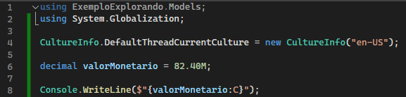
No exemplo acima a classe recebe um `new CultureInfo("en-US")` que formata o valor de acordo com a moeda dos Estados Unidos.

__*Este método deve ser utilizado com cautela, pois o mesmo vai setar o valor em toda a execução do programa.*__

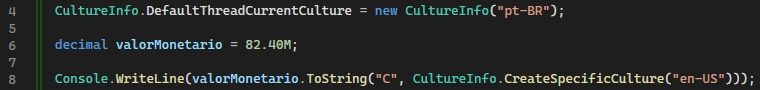
Caso seja necessário a formatação em apenas uma parte do sistema, é possível utilizar a formatação no método `.ToString`.

### Formatação personalizada
É possível determinar uma formatação personalizada, caso precise que o número seja formatado com 2 casas decimais ou porcentagem por exemplo.

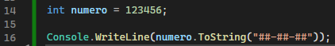
Neste exemplo, a saída será `12-34-56`.

#### Formatando casas decimais

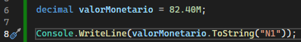
Neste exemplo, terá uma formatação de número com apenas uma casa decimal.

#### Formatando porcentagem

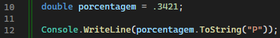
Neste exemplo, a saída formatada será `34,21%`

### Formatação do tipo DateTime
A classe `DateTime` é responsável por capturar a data e hora atual do sistema. Ela é muito útil para trabalhos que precisam de informação de data e hora, como em um banco de dados.

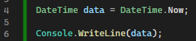
No exemplo acima, será capturada a data e hora completa no momento da execução do programa.

#### Formatando data e hora

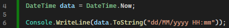
No exemplo acima, será feita a formatação padrão brasileira dispensando os segundos. Haverá diferença entre letras maiúsculas e minúsculas, como no caso de `MM` e `mm`, onde um representa mês e o outro minutos.

#### Somente data ou hora

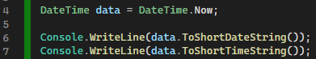
Podemos também obter somente a data ou somente a hora pelos métodos `.ToShortDateString()` e `.ToShortTimeString()`.

#### Conversões no DateTime

Nem sempre temos a nossa disposição a data e hora do sistema. Para isso podemos utilizar a conversão de string para o tipo DateTime.

##### Parse

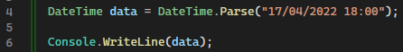
Neste caso estamos passando uma string que será convertida em DateTime.
Caso a data não seja válida, a classe vai apresentar um erro e o programa será encerrado.

##### TryParse

Podemos utilizar o método `.TryParseExact` para controlar melhor a formatação de datas para que não ocorra um erro caso seja passada uma data inválida.

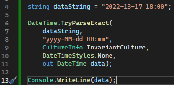
Neste caso, estamos passando uma data inválida com o mês 13.
O método `.TryParseExact` recebe 5 parâmetros:
1. `dataString` - A variável que será formatada
2. `yyyy-MM-dd HH:mm` - Como será a formatação
3. `CultureInfo.InvariantCulture` - A cultura de sistema
4. `DateTimeStyles.None` - O estilo do DateTime
5. `out DateTime data` - A variável de saída

Neste caso a saída será `01/01/0001 00:00:00` pois passamos um mês inválido, mas não ocorrerá um erro.

##### Validando o TryParse
O método `.TryParseExact` retorna um valor booleano, com isso podemos validar se o valor foi convertido ou não.

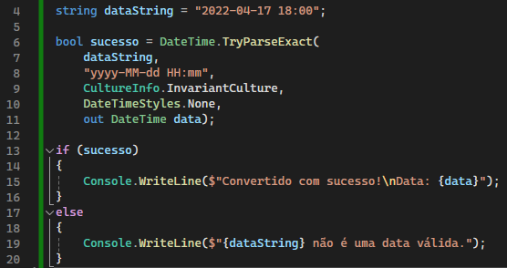

---

## Exceções e Coleções

Os recursos de manipulação de exceção ajudam você a lidar com quaisquer situações excepcionais ou inesperadas que ocorram quando um programa for executado.

### Realizando leitura de um arquivo

A classe `File` permite a leitura de arquivos através do endereço deles. Pode ser inserido como argumento o caminho completo do arquivo ou somente o arquivo a partir do programa.

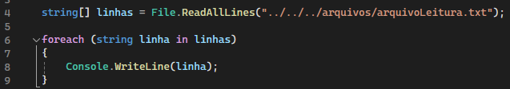
No exemplo acima é necessário utilizar o `../../../` pois o os arquivos de solução no visual studio são carregados a partir da pasta `bin/Debug/net6.0/`. Portanto é necessário que voltemos o caminho para a pasta do projeto.

### Disparando e tratando uma exceção

Nem sempre temos o caminho do arquivo bem escrito como no tópico acima, quando acontece, o programa dispara uma excessão e se encerra. Alguns códigos de erro serão impressos no terminal dando uma pista para que o desenvolvedor investigue onde está ocorrendo o erro.

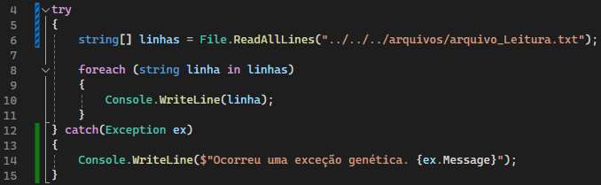
Para que não ocorra uma exceção e o programa continue sua execução, podemos utilizar o bloco `try` e caso o código dentro do bloco não seja executado corretamente, o bloco `catch` vai pegar uma exceção e exibir a mensagem definida pelo desenvolvedor.
A classe `Exception` captura as excessões ocorridas e as armazena na variável `ex`. A expressão `ex.Message` exibe uma mensagem genérica desta exceção que ocorreu e exibe no terminal.
