# Manipulação de Dados e Objetos com .NET

---

## Propriedades
As propriedades estão relacionada a abstração de valores para ler, gravar ou calcular valores de campos. 
Propriedades ajudam de maneira flexivel que as classes tenham tratamento de erros, evitando que o usuário insira dados inesperados para a operação.

### Propriedades de uma classe
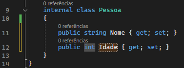
No exemplo acima, a classe Pessoa possui duas propriedades, Nome e Idade seguidas de `{ get; set; }` após a declaração.

### Modificadores de acesso
Os modificadores de acesso, são palavras reservadas que definem o acesso a propriedades, variáveis e métodos de uma classe.
Eles são para quando você precisa que a propriedade seja validada antes de ser atribuida. Uma variável privada só pode ser modificada por propriedades de dentro da classe, ou seja, somente após ela passar pela validação.

#### Tabela de modificadores de acesso

|Modificador|Função|
|---|---|
|`public`|Pode ser acessado por qualquer um do projeto ou fora dele|
|`private`|Só pode ser acessado pelo método ou classe de mesmo escopo|

### Validações GET e SET
As validações servem para evitar que sejam passados valores inesperados para uma variável.

#### Criando uma validação
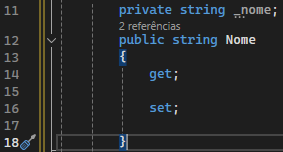
Para que uma validação seja feita, é preciso a declaração de uma variável *__privada__* do mesmo *__tipo__* da propriedade.
Dentro da propriedade __*Nome*__ será declarada as validações necessárias e a propriedade atribuirá o valor á variável privada `_nome`.

#### Validação GET

O exemplo acima indica que a propriedade __*Nome*__ receberá sempre os valores em maiúsculo por meio do método `.ToUpper()`.
Portanto todo valor recebido por essa propriedade passará por um tratamento antes de ser setado.

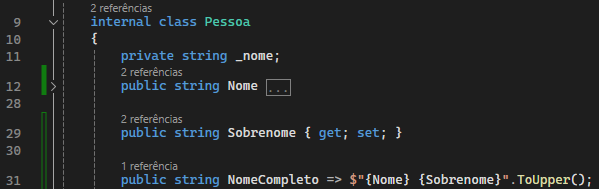
Uma propriedade pode ter somente `get` ou somente `set` e no caso de ter somente o `get`, podemos utilizar uma body expression para que esta retorne um valor concatenado como na propriedade `NomeCompleto` acima.

Quando uma propriedade possui somente uma validação `get` esta não pode ser setada de fora da classe. Então se você tentar setar um `NomeCompleto`, vai ocorrer um erro pois o mesmo só possui uma validação `get`.

#### Validação SET
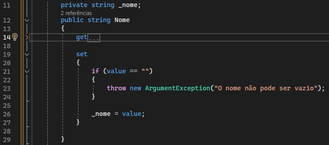
O exemplo acima indica que a propriedade __*Nome*__ não pode atribuir uma string vazia, caso receba, a palavra reservada `throw` vai exibir uma mensagem de erro por meio da classe `ArgumentException()` e não vai executar o restante do código.

#### Body Expressions
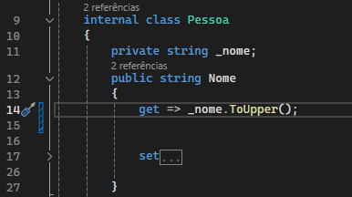
Quando temos uma validação muito simples, como o `return _nome.ToUpper()`, podemos utilizar uma body expression para simplificar mais ainda a leitura do código. Assim substituindo um bloco de código pelo símbolo `=>`.

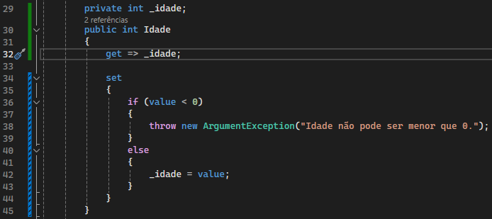
No exemplo acima, uma body expression foi utilizada para apenas atribuir o valor, dispensando a utilização do bloco e a palavra reservada `return`. Por outro lado, no método set não é possível a utilização de body expression, pois o mesmo faz uso de uma condicional if-else e necessita de um bloco.

---

## Métodos
Os métodos são ações que a classe pode executar. Nada mais são que outra forma de escrever uma função. Métodos auxiliam principalmente em reduzir drasticamente a repetição de um código.
Se seu programa tem muita reptição de código, considere criar um método para ele.

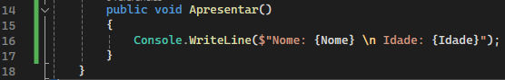
Os métodos de uma classe podem ser públicos ou privados dela.

### Assinatura de método
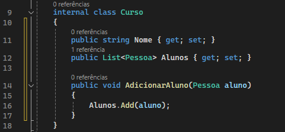
Todo método pode ser identificado por sua assinatura representado no exemplo por `void AdicionarAluno(Pessoa aluno)`. Consiste em `void` sendo o tipo de retorno, `AdicionarAluno` sendo o nome do método e `(Pessoa aluno)` sendo seus argumentos.
Mesmo que um método não possua argumentos os `()` são obrigatórios na declaração de um método.

### Tipos de retorno
Os tipos de retorno definem o que aquele método deve retornar ou até mesmo se ele não deve retornar nada.

#### Método sem retorno
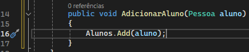
Os métodos sem retorno são caracterizados pela palavra reservada `void`. Métodos sem retorno são metodos que realizam uma ação e não retornam valor algum.

#### Método com retorno
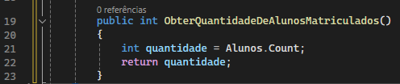
Os métodos com retorno são caracterizados pelo tipo de retorno após o modificador de acesso. Ele pode ser qualquer tipo da linguagem C#, como `string`, `int`, Valores retornado por outros metodos, etc.

---

## Construtores
Os construtores possibilitam que a classe receba os valores no momento de sua instanciação.

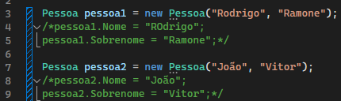
No exemplo acima, podemos ver que ao invés de declarar e atribuir as propriedades `.Nome` e `.Sobrenome`, elas passam a ser declaradas como argumento em sua instanciação.

### Criando um construtor
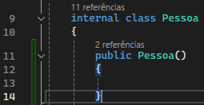
Um construtor, por convenção, é sempre declarado logo abaixo da classe e deve obrigatoriamente possuir o mesmo nome da classe. Sua sintaxe se assemelha a sintaxe de uma função, com seus argumentos sendo inseridos dentro de `()`.

### Construtor com argumentos
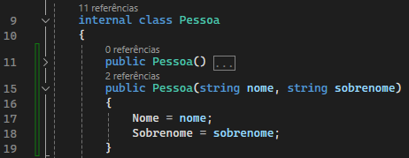
Os argumentos de um construtor são declarados com seu tipo e nome de utilização.
Caso os parametros não sejam declarados no momento de sua instanciação, ocorrerá um erro. Para evitar isto, um construtor de mesmo nome e sem argumentos deve ser criado.
Portanto a classe pode ser declarada com argumentos ou não neste caso.

