# Programação de APIs com Banco de Dados

## Banco de dados

Um banco de dados é uma coleção organizada de informações (ou dados) estruturadas, normalmente armazenadas eletronicamente em um sistema de computador.

### Tipos de banco de dados

#### Banco de dados relacional

O tipo mais usado atualmente, armazenando dados estruturados, sendo organizado em tabelas, com colunas e linhas, que se relacionam entre si.
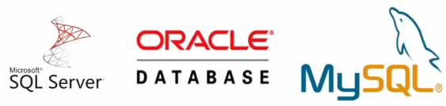
A escolha do banco de dados depende diretamente de sua aplicação.
O MySQL é uma solução gratuita que comporta um pequeno volume de acessos, o que faz dele uma solução ideal para pequenas aplicações individuais, porém, quando precisamos de algo mais robusto como um sistema de um hospital do qual não pode haver indisponibilidade, o uso do Oracle ou SQL Server é mais indicado.

##### Tabelas
São dados estruturados e organizados logicamente em formato de linha e coluna.
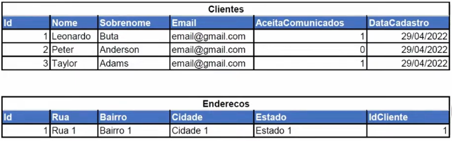
Assim como uma tabela de excel, tabelas de banco de dados são estruturadas em colunas e linhas. Suas colunas indicam seu tipo de dado e as linhas são o dado em si.
Na imagem acima temos uma relação entre a tabela de endereços na coluna `IdCliente` que se relaciona com a tabela de clientes por meio da coluna `Id`.

#### Banco de dados não relacional
Banco de dados onde os dados não são armazenados em tabela e sim armazenados de maneira não estruturada ou semi-estruturada.

O mongoDB é o banco de dados não relacional mais utilizado e existem vários tipos, sendo alguns deles o document databases(mongoDB), key-value databases, wide-column stores e graph databases.
Um banco de dados relacional tem uma estrutura rígida de armazenamento de dados. Se uma coluna é definida como booleana, ela não pode receber valores inteiros ou de texto por exemplo.

##### Dados semi estruturados
Os banco de dados não relacionais podem utilizar dados semi estruturados para armazenar seus dados.

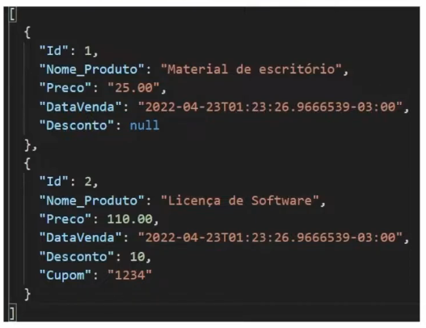
Neste exemplo temos um arquivo JSON que pode ser uma das estruturas de dados utilizadas em um banco de dados não relacional.
Diferente do banco de dados relacional, a estrutura pode ser variável, contendo dados diferentes e de tipos diferentes.

### Database Management System (DBMS)
É um software utilizado para acessar, manipular e monitorar um sistema de banco de dados.

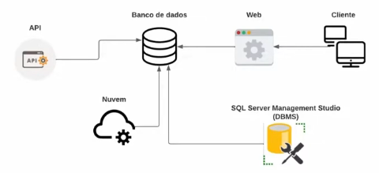
Um banco de dados funciona de forma stand alone, porém, para que você desenvolvedor manipule o banco de dados, é necessário um software que funciona de forma parecida com uma IDE, mas que é voltada a manipulação de um banco de dados. No caso do SQL server, temos o SQL Server Management Studio.

### Instalação e configuração

#### Instalando SQL server Express

1.  Acesse o site para download do [SQL Server](https://www.microsoft.com/pt-br/sql-server/sql-server-downloads)
2. Procure pela __Edição especializada gratuita__
3. Baixe a versão __Express__
4. Selecione a versão Básica e siga os passos até o fim da instalação

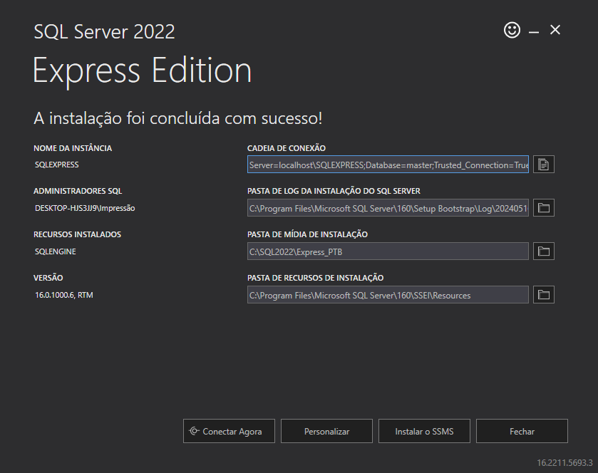
Ao final da instalação será exibida informações úteis para manipulação do banco de dados com o DBMS.
A informação de `CADEIA DE CONEXÃO` será a informação utilizada para conexão com o banco de dados.

#### Configurando SQL server

1. Abra o SQL Server Configuration Manager
2. Na aba esquerda, clique em __SQL Server Services__
3. Note que o __SQL Server (SQLEXPRESS)__ está como running
Isso quer dizer que seu servidor está rodando
4. Clique duas vezes em __SQL Server (SQLEXPRESS)__
5. Na aba __Serviços__ troque o __Modo inicial__ para manual
Isso vai te dar controle sobre o estado do banco de dados

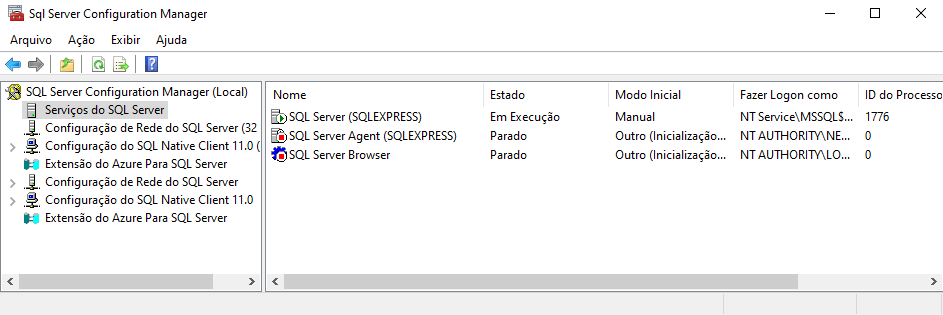

#### Instalando Server Management Studio (SSMS)

1. Acesse o site para download do [SSMS](https://learn.microsoft.com/pt-br/sql/ssms/download-sql-server-management-studio-ssms?view=sql-server-ver16)
2. Vá a até a sessão __Baixar o SSMS__
3. Clique em __Baixar o SSMS (SQL Server Management Studio)__
4. Siga os passos do instalador

#### Configurando SSMS

1. Em __Tipo de servidor__ utilize o Mecanismo de Banco de Dados
2. Em __Nome do servidor__ troque para `localhost\sqlexpress`
Que foi o SQL server que instalamos anteriormente
3. Em __Autenticação__ podemos utilizar a Autenticação do Windows padrão
*Caso precise acessar de maneira externa será necessário utilizar a __Autenticação do SQL Server__ com login e senha*
4. Em __Criptografia__ troque para Opcional

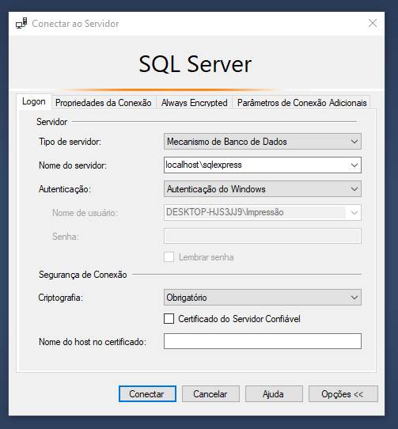

---

## Structured Query Language (SQL)

É a linguagem de banco de dados usada para consulta e manipulação de dados. A linguagem SQL na maioria dos casos é utilizada em todos os bancos de dados, portanto, aprendendo em um banco de dados, será possível utilizar este conhecimento em todos os outros.

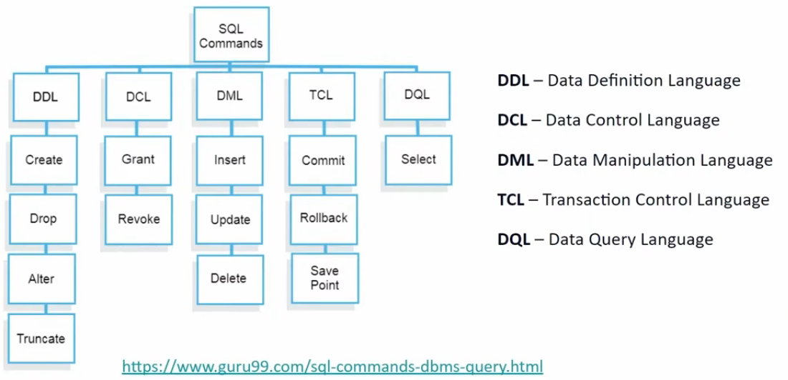

### Banco de dados
É uma coleção de dads estruturados, agrupados de forma concisa. É composto de tabelas, procedures, views, etc.

Um banco de dados pode conter vários databases destinado a vários sistemas. Eles separam as tabelas de dados para que possam ser acessados de diferentes aplicações, além de especificar o banco que a aplicação irá trabalhar, será necessário especificar também qual database será acessado.

#### Criando um Banco de dados

1. No SSMS, clique com o botão direito do mouse em __Banco de dados__
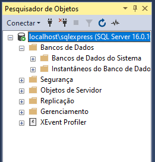
2. Clique em __Novo banco de dados__
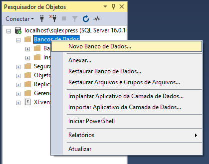
3. Dê um nome para o Banco de dados e clique em OK
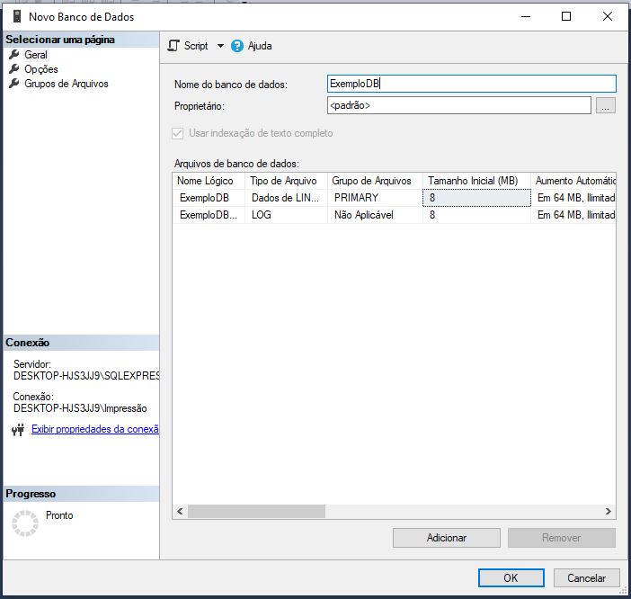

##### ID
Todo dado dentro de um banco de dados tem um ID único, que garante que cada dado inserido dentro do banco de dados seja único.

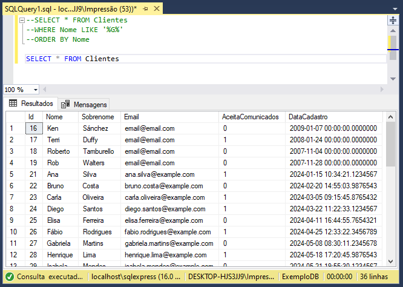
Note que mesmo que façamos a remoção de um dado e inserirmos ele normamente, ele não será o mesmo ID, pois este é incrementado sempre que um novo dado é inserido no banco de dados.

#### Fazendo uma consulta
Ao selecionar um database podemos abrir uma __Nova Consulta__.
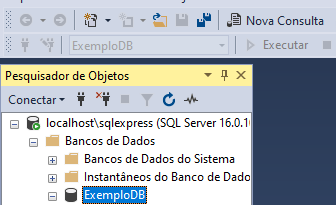

Fique atento para qual banco de dados sua consulta está apontando.
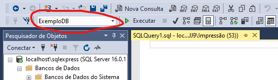
Sempre que se conectar novamente ao banco de dados, a Query pode estar apontando para a master, então ocorrerá um erro caso você faça uma nova consulta. Portanto atente-se para onde a sua query está apontando sempre que se conectar ao Banco de dados.

##### SELECT
O comando `SELECT` servirá para selecionar uma tabela do banco de dados. Desse modo será feita uma consulta pela tabela especificada após o comando `FROM`. O `*` Representa todas as colunas da tabela.

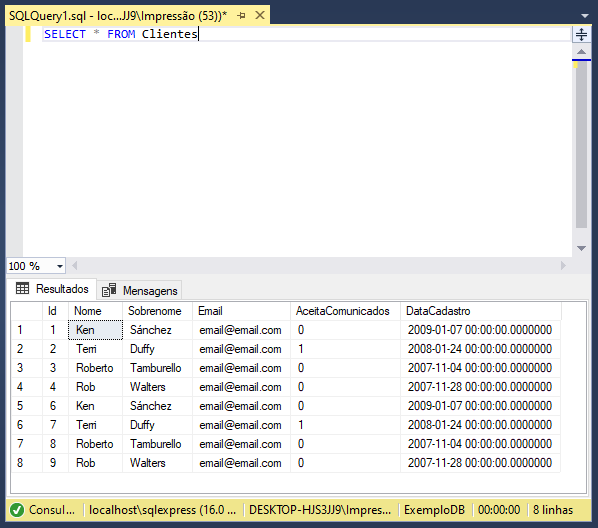
Ao executar o comando digitado, será exibida uma *Result Grid* com o conteúdo da tabela.

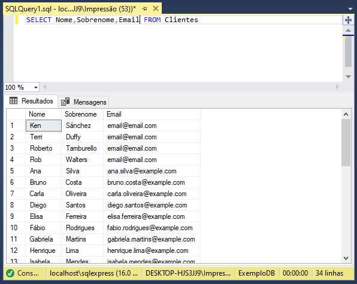
Para selecionar colunas específicas do banco de dados, no lugar do `*` especifique o nome das colunas que deseja selecionar.

##### ORDER BY

O comando `ORDER BY` é responsável por ordenar a tabela em ordem crescente por padrão.

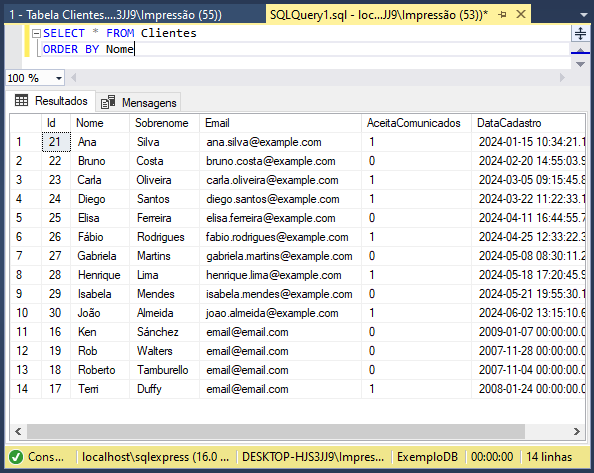

Podemos também utilizar o comando `DESC` para ordenar a tabela por ordem descrescente.

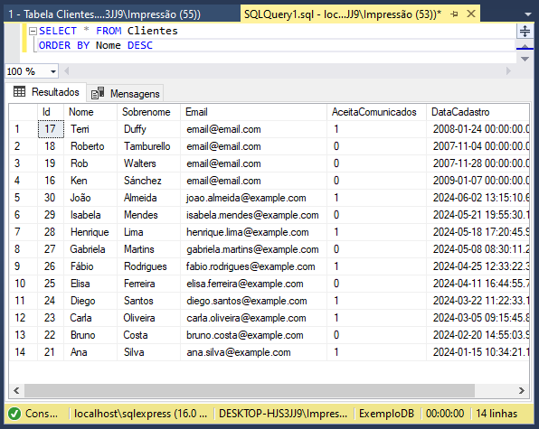

Também é possível ordenar através de várias colunas, colocando as colunas desejadas separadas por vírgula.

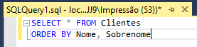
Com este comando será ordenada a coluna de nome por ordem crescente e a coluna sobrenome logo em seguida. Neste exemplo ele ordenará os sobrenomes na ordem crescente após ordenar os nomes, no caso de existirem nomes repetidos.

##### WHERE
Em alguns casos queremos que sejam exibidos apenas dados específicos, para isso utilizamos a clausula `WHERE`.

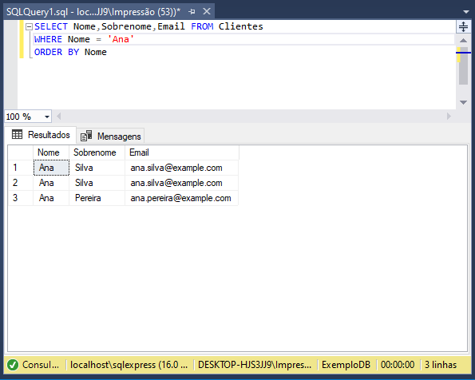
No exemplo acima filtramos o nome Ana e ele trouxe somente o nome especificado na coluna Nome. __*Em SQL sempre será utilizado áspas simples para escrever strings.*__

###### AND e OR
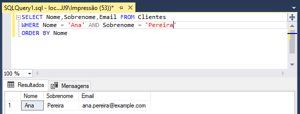
Caso seja necessário mais de um filtro, a clausua `AND` é utilizada para declarar uma outra coluna da qual o filtro obterá informações.

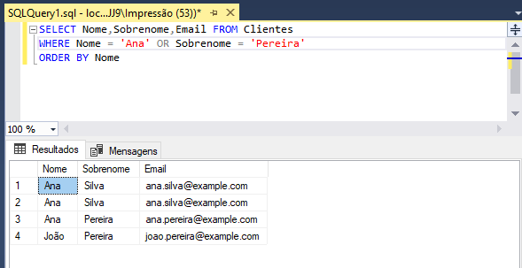
Assim como na lógica de programação o `OR` também pode ser utilizado.

###### LIKE
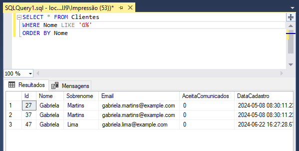
Quando precisamos que a pesquisa seja não somente de um nome específico, mas sim de um nome que comece com uma letra específica, utilizamos o `LIKE` no lugar do `=`, que irá procurar por dados que comecem com a letra especificada.
O sinal de `%` após a letra significa que o filtro especificado trará somente o que começa com a letra G ignorando o que vier após ela. Utilizando o sinal `%` antes e depois desta forma `%G%`, será mostrado qualquer dado que contenha a letra G independente da localização dentro da string.

##### INSERT
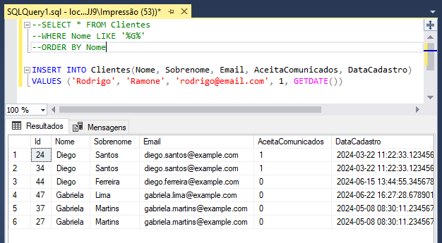
Quando queremos inserir dados numa tabela utilizamos o comando `INSERT INTO` especificando a tabela logo em seguida e as colunas a serem inseridas. Após o comando `INSERT` devemos especificar o valor a ser inserido com `VALUES` especificando entre `()` os valores a serem inseridos __na ordem especificada anteriormente__.
O comando `GETDATE()` é uma função que captura a data atual. O banco de dados por se tratar de uma tabela estruturada, não aceitará que você insira um dado que não obedece a especificação dada no momento de sua criação, portanto, __*caso você tente inserir um dado que não seja o esperado, o banco retornará um erro.*__

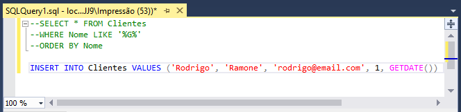
Também podemos inserir os valores diretamente omitindo a declaração das colunas, porém, __*será necessário obedecer a ordem correta das colunas*__. É util para resumir a declaração de inserção no banco de dados.

##### UPDATE
Quando precisamos fazer uma atualização, como a mundança de um email no banco de dados, utilizamos o comando `UPDATE`. Este comando atualiza a informação desejada através da clausula `SET`.

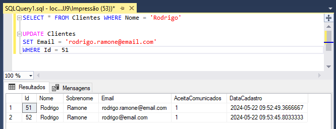
__*É muito importante que seja feita a atualização pelo `id`, pois sem ele você poderá alterar dados que não correspondem ao dado requisitado. Caso não fosse declarado o `WHERE` nesta atualização, as duas linhas com nome `Rodrigo` teriam seu email atualizado.*__

###### JAMAIS FAÇA UM UPDATE SEM WHERE

##### DELETE

Quando precisamos deletar um dado de uma tabela, utilizamos o comando `DELETE` seguido do `WHERE` para especificar o que será deletado.

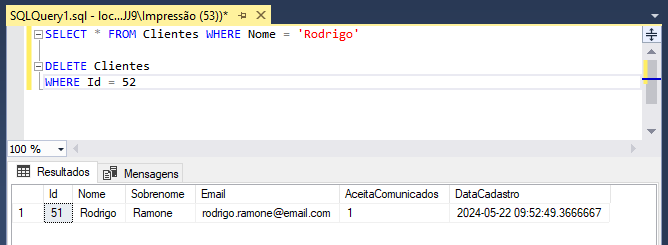
No exemplo acima deletamos o dado de id 52 que correspondia ao mesmo dado de id 51. Neste caso tinhamos um dado duplicado.

###### JAMAIS FAÇA UM DELETE SEM WHERE

#### Criando uma tabela

A criação de uma tabela pode ser feita utilizando o comando `CREATE TABLE` e em seguida declarando seu nome e tipos de dados de irão conter na tabela.

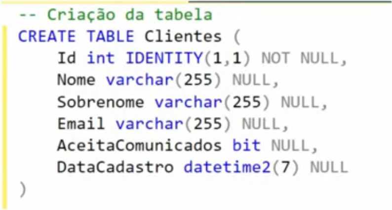
Note que nos campos onde criamos as colunas, primeiro inserimos o nome da coluna, o seu tipo e entre `()` está o tamanho daquele campo.

##### PRIMARY KEY

A clausula `PRIMARY KEY` vai garantir que o campo será único.

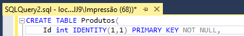
No exemplo acima especificamos que o campo Id terá sempre um valor único.

##### IDENTITY

A clausula `IDENTITY` é onde especificamos que este campo será gerenciado pelo próprio banco de dados. Toda tabela deve ter uma coluna de Id, mas ela não é obrigatória ao inserir dados na tabela.

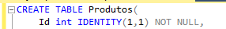
Entre `()` colocamos o valor inicial e qual será o incremento deste campo. Neste caso ele se inicia em 1 e incrementa uma inidade a cada campo adicionado.

##### NULL e NOT NULL

As clausulas `NULL` e `NOT NULL` servem como validações indicando que aquele campo é ou não obrigatório.

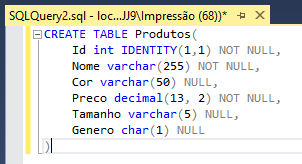
No exemplo acima temos os campos `Cor`, `Tamanho` e `Genero` que podem receber valores vazios no momento da inserção destes dados, caso algum destes não sejam conhecidos no momento de sua insenção no banco de dados.

#### Tipos de Dados SQL Server

##### Tipos de Dados numéricos

| Tipo de Dados   | Descrição |
|-----------------|------------|
| `bit`           | Pode armazenar 1, 0 ou NULL. |
| `tinyint`       | Armazena números inteiros de 0 a 255. |
| `smallint`      | Armazena números inteiros de -32.768 a 32.767. |
| `int`           | Armazena números inteiros de -2.147.483.648 a 2.147.483.647. |
| `bigint`        | Armazena números inteiros de -9.223.372.036.854.775.808 a 9.223.372.036.854.775.807. |
| `decimal(p,s)`  | Armazena números fixos e flutuantes. A precisão (p) pode ser de 1 a 38 e a escala (s) de 0 a p. |
| `numeric(p,s)`  | Funcionalmente igual ao `decimal`. |
| `smallmoney`    | Armazena valores monetários de -214.748,3648 a 214.748,3647. |
| `money`         | Armazena valores monetários de -922.337.203.685.477,5808 a 922.337.203.685.477,5807. |
| `float(n)`      | Armazena números flutuantes. O número de bits n define a precisão. |
| `real`          | Armazena números flutuantes com precisão de 7 dígitos decimais. |

##### Tipos de Dados de Cadeia de Caracteres

| Tipo de Dados   | Descrição |
|-----------------|------------|
| `char(n)`       | Armazena uma cadeia de caracteres de comprimento fixo. n pode ser de 1 a 8.000. |
| `varchar(n)`    | Armazena uma cadeia de caracteres de comprimento variável. n pode ser de 1 a 8.000. |
| `varchar(max)`  | Armazena uma cadeia de caracteres de comprimento variável. Máximo de 2^31-1 caracteres. |
| `text`          | Armazena uma cadeia de caracteres de comprimento variável. Máximo de 2.147.483.647 caracteres. |

##### Tipos de Dados de Cadeia de Caracteres Unicode

| Tipo de Dados   | Descrição |
|-----------------|------------|
| `nchar(n)`      | Armazena uma cadeia de caracteres Unicode de comprimento fixo. n pode ser de 1 a 4.000. |
| `nvarchar(n)`   | Armazena uma cadeia de caracteres Unicode de comprimento variável. n pode ser de 1 a 4.000. |
| `nvarchar(max)` | Armazena uma cadeia de caracteres Unicode de comprimento variável. Máximo de 2^31-1 caracteres. |
| `ntext`         | Armazena uma cadeia de caracteres Unicode de comprimento variável. Máximo de 1.073.741.823 caracteres. |

##### Tipos de Dados Binários

| Tipo de Dados   | Descrição |
|-----------------|------------|
| `binary(n)`     | Armazena dados binários de comprimento fixo. n pode ser de 1 a 8.000. |
| `varbinary(n)`  | Armazena dados binários de comprimento variável. n pode ser de 1 a 8.000. |
| `varbinary(max)`| Armazena dados binários de comprimento variável. Máximo de 2^31-1 bytes. |
| `image`         | Armazena dados binários de comprimento variável. Máximo de 2.147.483.647 bytes. |

##### Tipos de Dados de Data e Hora

| Tipo de Dados   | Descrição |
|-----------------|------------|
| `date`          | Armazena uma data. Formato: AAAA-MM-DD. |
| `datetime`      | Armazena uma data e hora. Formato: AAAA-MM-DD hh:mm:ss[.mmm]. |
| `datetime2`     | Armazena uma data e hora com precisão adicional. Formato: AAAA-MM-DD hh:mm:ss[.fractional seconds]. |
| `smalldatetime` | Armazena uma data e hora. Formato: AAAA-MM-DD hh:mm:ss. |
| `time`          | Armazena uma hora do dia. Formato: hh:mm:ss[.mmm]. |
| `datetimeoffset`| Armazena uma data e hora com um deslocamento de fuso horário. Formato: AAAA-MM-DD hh:mm:ss[.mmm] {+|-}hh:mm. |
| `timestamp`     | Armazena um número único que é atualizado sempre que a linha é modificada. |

##### Outros Tipos de Dados

| Tipo de Dados   | Descrição |
|-----------------|------------|
| `sql_variant`   | Armazena dados de diversos tipos de dados SQL Server, exceto `text`, `ntext`, `image`, `timestamp` e `sql_variant`. |
| `uniqueidentifier` | Armazena um identificador global exclusivo (GUID). |
| `xml`           | Armazena dados XML. Máximo de 2^31-1 bytes. |
| `cursor`        | Armazena uma referência a um cursor utilizado para operações de banco de dados. |
| `table`         | Armazena um conjunto de resultados para processamento posterior. |

#### Manipulando dados

##### Built-in functions
Built-in functions são funções pré-existentes que auxiliam na manipulação de dados, como por exemplo contar, somar, média, etc...

##### COUNT
A função `COUNT` servirá para contar a quantidade de linhas de uma tabela que atendem a determinada condição.
Em alguns casos podemos querer que o banco de dados retorne apenas a quantidade de linhas contidas na tabela. Podemos sim fazer um `SELECT` simples, mas quando temos um banco com milhões de linhas, trazer todas as informações contidas nessas linhas seria um desperdício de recurso de processamento.

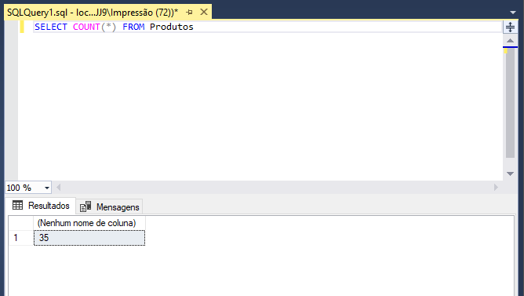
No exemplo acima utilizamos o `COUNT(*)` para que seja retornado apenas a quantidade de linhas contida no banco, neste caso, 35 linhas.

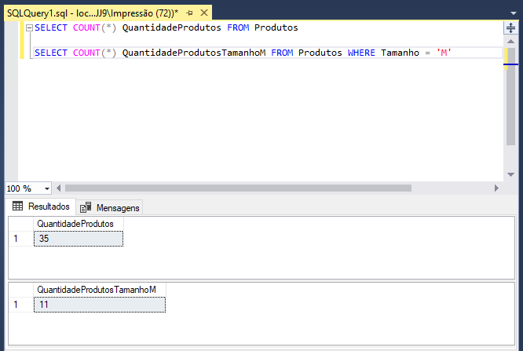
Podemos também dar nome a coluna que retorna para tornar a query mais clara.

##### SUM
A função `SUM` do SQL serve para somar valores numéricos contidos em uma coluna do banco de dados.

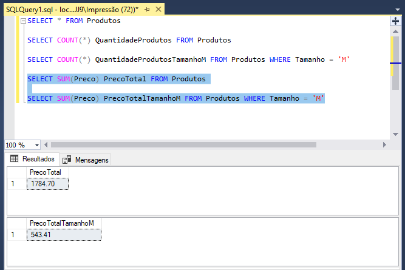
No exemplo acima somamos primeiro os valores de todas as linhas da coluna preço, também fizemos outra query que utiliza o `WHERE` para somar todos os preços de produtos do tamanho M.

##### MIN, MAX e AVG
As funções `MIN MAX AVG` são utilizadas para retornar o menor valor, maior valor e a média de valores contido na tabela.

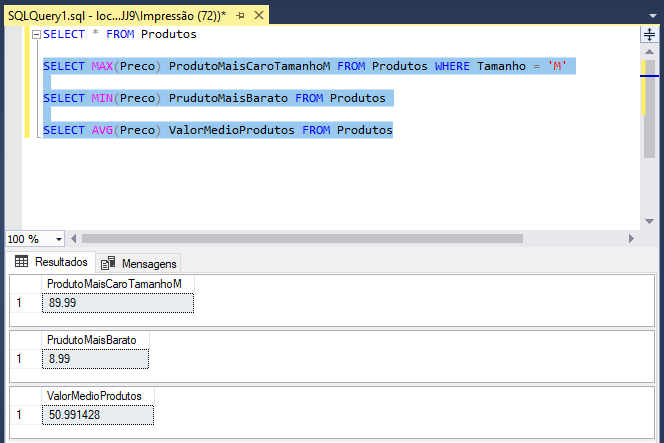
No exemplo acima temos o maior valor de tamanho M contido na tabela, o menor valor da coluna de preços em geral e a média dos valores de preço.

##### Concatenando Colunas
Em alguns casos queremos que o banco de dos retorne valores de uma coluna concatenados com outra coluna. Podemos utilizar no comando `SELECT` o sinal de concatenação `+` para fazer a junção de dados de diferentes colunas.

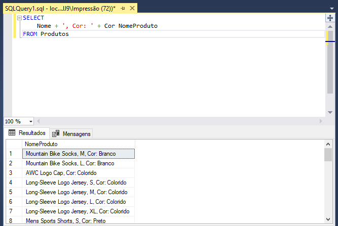
No exemplo acima concatenamos a coluna Nome com a Coluna Cor e um texto entre elas. O retorno foi uma coluna de nome `NomeProduto` com as respectivas colunas concatenadas.

##### Upper e Lower
Podemos fazer tratamentos no texto que é retornado pelo banco de dados utilizando a função `UPPER()` para transformar tudo em maiúsculo e `LOWER()` para transformar tudo em minusculo.

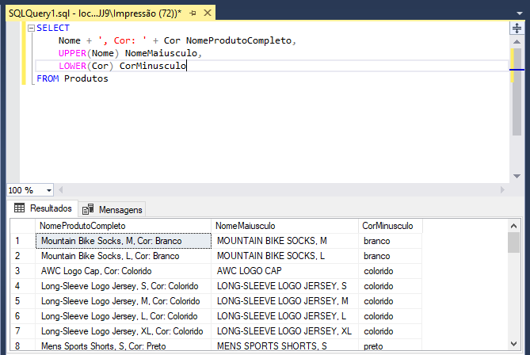
No exemplo acima utilzamos o `UPPER` para retornar dados de nome em maiúsculo e o `LOWER` transformar dados de cor em minúsculo.

##### Adicionando uma nova coluna
Podemos adicionar colunas a uma tabela de duas maneiras. Por meio de script e por meio visual. É recomendável que sempre seja inserido por script.

###### Adicionando coluna de maneira visual

1. Navegue pelo seu banco de dados até a tabela desejada
2. Clique com o botão direito na tabela a ser adicionada a coluna
3. Clique na opção __Design__
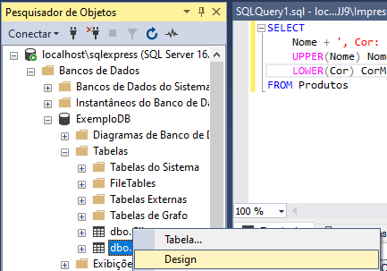
4. Digite o Nome da coluna, seu tipo e se é nullable abaixo da última coluna existente na tabela
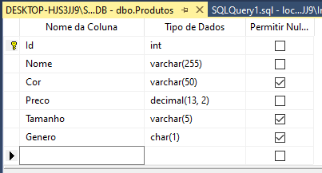
5. Pressione __ctrl + S__ para salvar

__*Para deletar uma coluna*__
1. Clique com o botão direito na setinha preta da coluna a ser deletada
2. Clique em __Excluir Coluna__
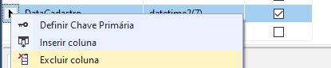
3. Pressione __ctrl + S__ para salvar

###### Adicionando coluna por script
Adicionar uma coluna por script é muito simples e requer apenas alguns comandos.
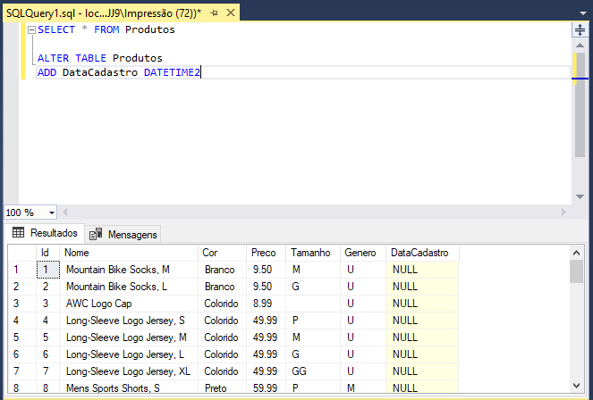
Utilizamos o comando `ALTER TABLE` para indicar que faremos uma alteração na tabela. Em seguida utilizamos o `ADD` seguido do nome da coluna e seu tipo.

__*Para deletar uma coluna*__

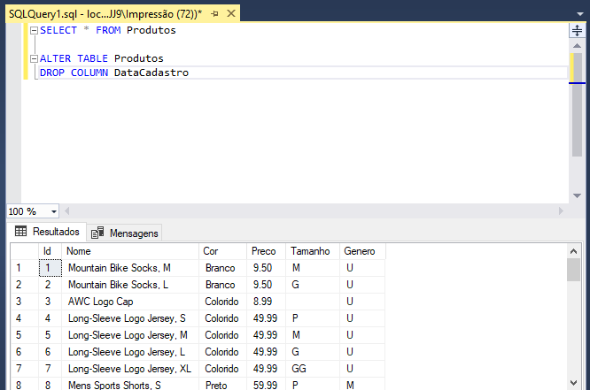
Para deletar uma coluna utilizamos para alterar uma tabela e utilizamos o `DROP COLUMN` seguido do nome da coluna.

##### FORMAT
Podemos utilizar a função `FORMAT()` para formatar dados do tipo `DATETIME` por exemplo.

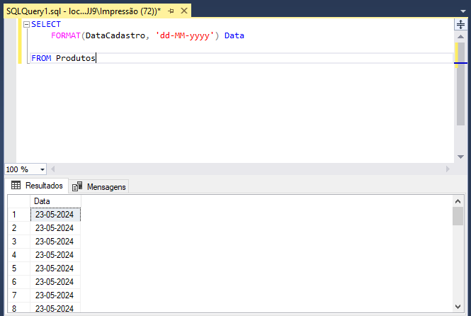
No exemplo acima formatamos o `DATETIME2` adicionado anteriormente para o padrão brasileiro de data. Agit  função `FORMAT()` recebe a coluna a ser formatada e a formatação desejada como argumento separado por vírgula.
__A sintaxe de formatação é bem parecida com o C#.__

##### Group By
Podemos fazer agrupamentos com base em determinadas condições. A clausula `GROUP BY` pode ser utilizada para agrupar essas informações trazidas do banco de dados.

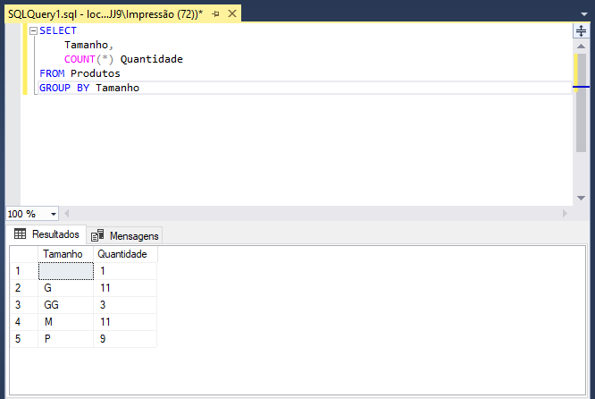
No exemplo acima, podemos ver que primeiro selecionamos o tamanho e utilizamos o `COUNT()` para contar a quantidade de cada agrupamento. A clausula `GROUP BY` recebe o tamanho e nos retorna a quantidade de cada tamanho de roupa contida no banco de dados.
__Observe que temos um dado em branco, isso acontece por conta de um dado no banco que não possui informação de tamanho especificada.__

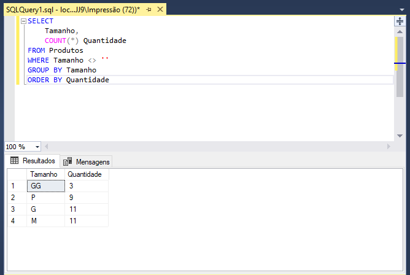
Podemos utilizar a clausula `WHERE` com o sinal de `<>` que indica é diferente e uma condição de string vazia `''` que indica que tudo que estiver fazio na coluna tamanho não será retornado pelo banco. Também pode ser utilizado com a clausula `ORDER BY` para ordenar pela quantidade.

__*Esteja atendo para a ordem das querys. Um `ORDER BY` não pode vir antes de um `GROUP BY` para que não ocorra erros lógicos na execução da query.*__

##### Primary Key e Foreign Key
São valores utilizados para identificação de registro de uma tabela e também entre tabelas.

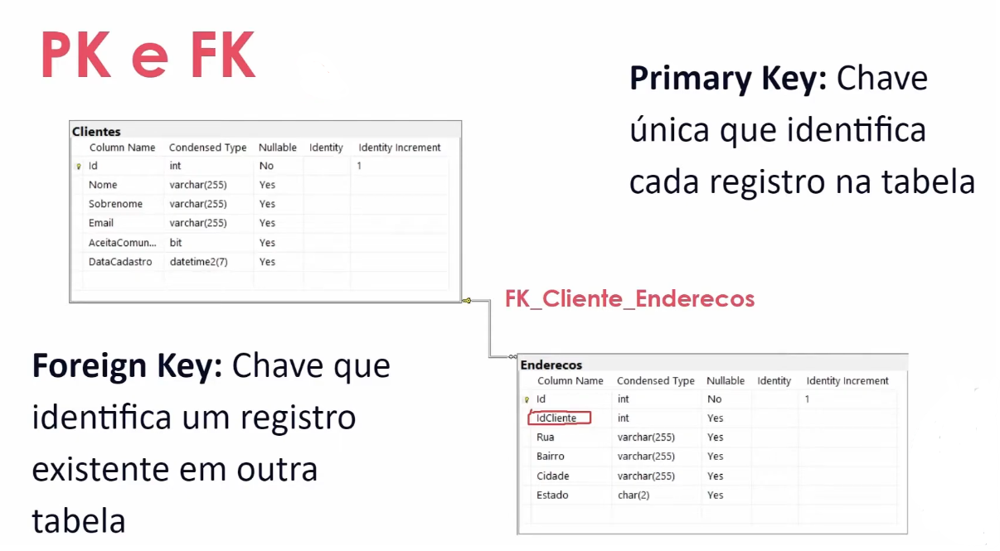
Estas chaves vão servir para que uma tabela interaja com a outra. Quando temos uma tabela de clientes por exemplo, este recebe um ID único que pode ser registrado numa tabela de endereços de forma que relaciona aquele endereço com o cliente.

###### Criando uma tabela de endereços com Foreign Key
__1. Definindo uma Primary Key__
1. Na tabela clientes que já criamos anteriormente
2. Navegue até ela no banco de dados e clique com o botão direito do mouse
3. Selecione a opção __Design__
4. Clique com o botão direito do mouse na chave que deseja transfomar em primary key
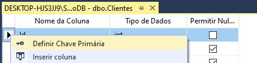
5. Clique em __Definir Chave Primária__
6. Pressione __Ctrl + S__ para salvar

__2. Criando uma tabela com Foreign Key__
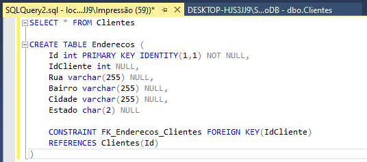
Uma chave estrangeira sempre será uma `CONSTRAINT`, ou seja, uma restrição.
A clausula vem acompanhada de seu nome e sua definição como `FOREIGN KEY` que recebe como argumento a coluna que será armazenada a chave.
A clausula `REFERENCES` fará referencia a onde estes dados serão capturados, neste caso, de `Clientes(Id)` fazendo refernência ao Id da tabela Clientes.

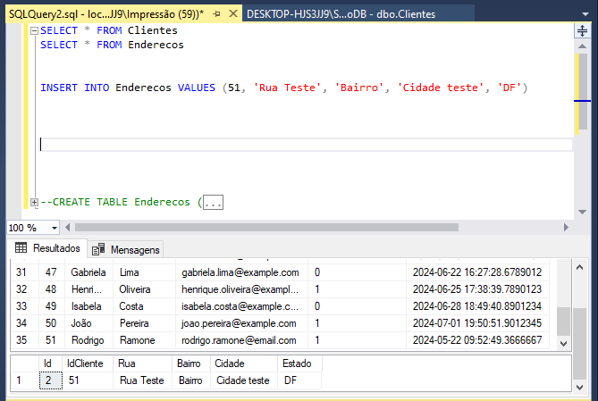
Então após fazer a inserção de um dado na tabela de endereços, passamos para ela o Id correspondente na tabela Clientes. Agora a tabela de endereço possui um dado que referencia por meio da chave estrangeira a qual cliente ela faz referencia.

##### JOIN
Podemos notar que sempre que fazemos um `SELECT` em uma tabela o banco retorna para nós as informações solicitadas, sendo assim necessário um `SELECT` para cada tabela que queremos consultar.

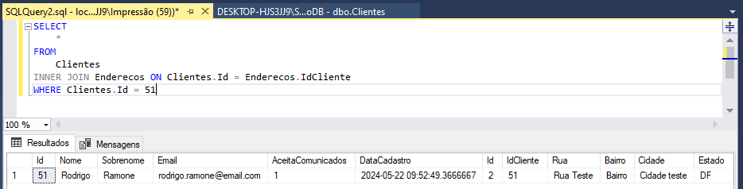
Podemos utilizar a clausula `INNER JOIN` para juntar a tabela `Enderecos` na tabela `Clientes` por meio da clausula `ON` passando para ela o `Clientes.Id` como refência da foreign key `Enderecos.IdClientes`.
Executando a query com o `WHERE` podemos ver que o banco retornou o valor correspondente da tabela Clientes e logo em seguida os dados da tabela Endereco.
Dessa forma o banco entende que deve juntar toda informação correspondente a `Clientes.Id` igual a `Enderecos.IdCliente` assim relacionando as tabelas.

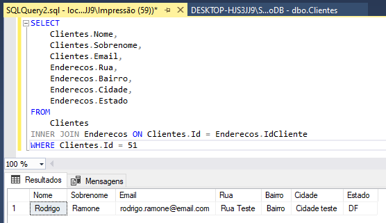
Podemos então fazer um `SELECT` dos dados contidos em duas tabelas e o banco nos retornará apenas uma linha pois fizemos um `JOIN` delas.

###### Outros tipos de JOIN
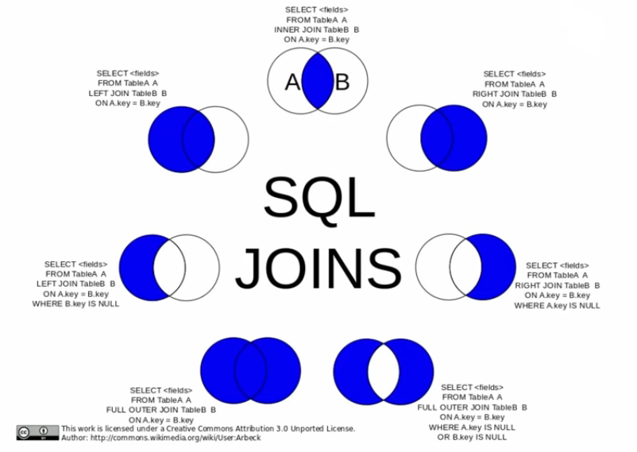

---

## APIs e Entity Framework

### O que é uma API
Uma API (Application Programming Inferface) é uma forma de comunicação entre computadores ou programas de computadores.
Em outras palavras, é um software que fornece informações para outro software.

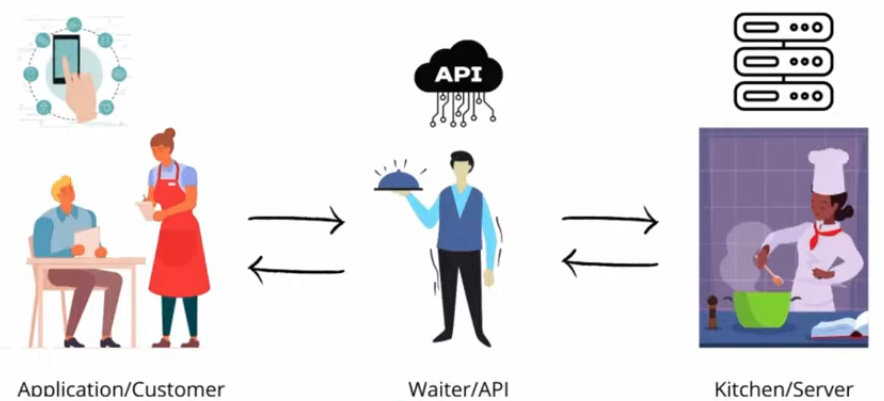
Um dos exemplos mais difundidos sobre o que é uma API é de um restaurante. A API, como demonstrado na imagem, é como um garçom que faz a interação do cliente com a cozinha, ou seja, leva seu pedido até o banco de dados, o banco processa esses dados e entrega para a API a informação processada sem que você veja todo esse funcionamento.

### Exemplo de APIs

#### Nager.Date
A [Nager.Date](https://date.nager.at/) é uma API que contém todos so feriados de cada país organizados em seus respectivos dias do ano.
Suponhamos que você tenha uma aplicação que conta dias úteis para dar um prazo de entrega para um cliente. Teriamos de catalogar cada feriado manualmente dentro da aplicação desenvolvida e isso levaria muito tempo, para isso temos APIs que facilitam esse processo.

##### Utilizando a API
Podemos sempre acessar o site do Nager.Date para ver os feriados, mas no caso de uma aplicação, esta deve acessar de maneira que você não precise estar entrando no site e procurando por cada feriado.
Para isso utilizamos a [Holiday API](https://date.nager.at/Api). Nesta página podemos ver a documentação de como é feita a utilização desta API.

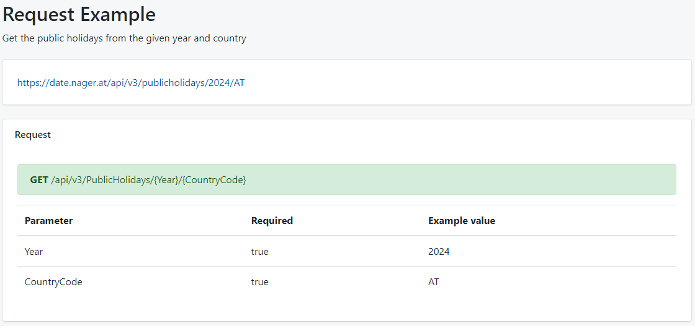
Na sessão __Request Example__ podemos ver um exemplo de como é feita a requisição na API e seu retorno será um arquivo JSON com todos os feriados presentes no país e ano requisitados a ela.

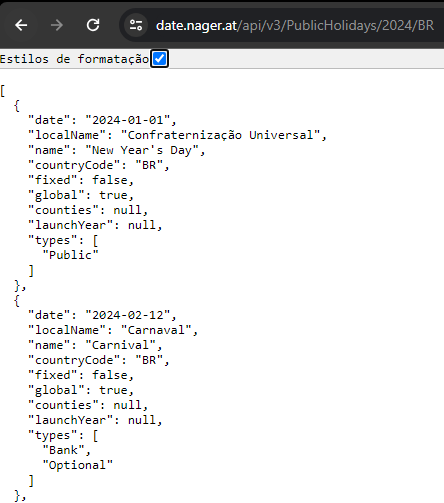
Podemos observar que no link acima solicitamos para a API os feriados de 2024 no Brasil e ela nos retorna um arquivo que para o usuário não terá sentido algum, mas para a aplicação que o usuário estará utilizando fará total sentido.

Toda API possui uma documentação explicando a forma como o desenvolvedor deve se comunicar com ela. No caso da Date.Nager a documentação deixa bem claro que devemos passar o `{Year}/{CountryCode}` no link da requisição para que ela retorne os dados esperados. Caso essa regra não seja respeitada a API retornará um erro.

#### Dog CEO
A [Dog CEO](https://dog.ceo/) é uma coleção de imagens de cachorro open source. Ela é utilizada para retornar uma imagem de cachorro aleatória sempre que é feita uma requisição

##### Utilizando a API

Em [Dog API](https://dog.ceo/dog-api/) teremos acesso a documentação da API e como é feita a sua utilização.

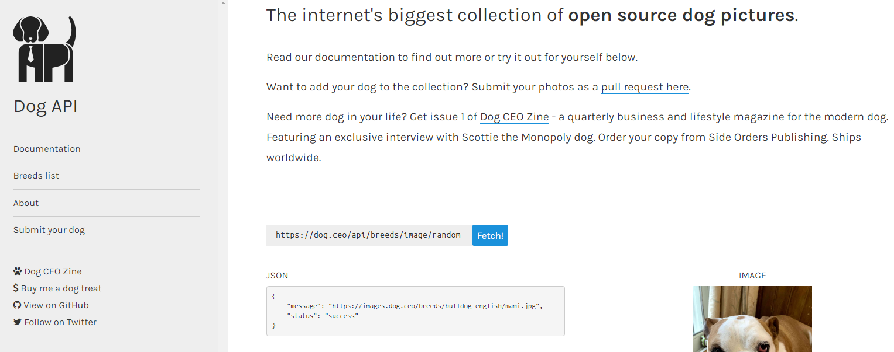
Podemos observar que a API recebe uma requisição assim como nos exemplos anteriores e retorna um JSON com o link da imagem solicitada e o status.

### Criando a nossa API

No Visual Studio temos a nossa disposição modelos de projeto para a criação de APIs.
__*Verifique se você instalou o pacote de desenvolvimento web junto ao seu Visual Studio.*__

1. Crie um novo projeto *API Web do ASP.NET Core*
2. Dê um nome ao seu projeto e defina um diretório para ele
3. Defina a versão do .NET que será utilizada e mantenha os marcadores padrão selecionados
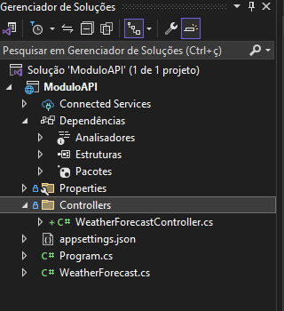
Você terá uma tela de projeto semelhante a esta

Nesta pasta `Controllers` é um exemplo de API que já vem carregada no modelo de projeto, parecido com quando criamos um `HelloWorld`.

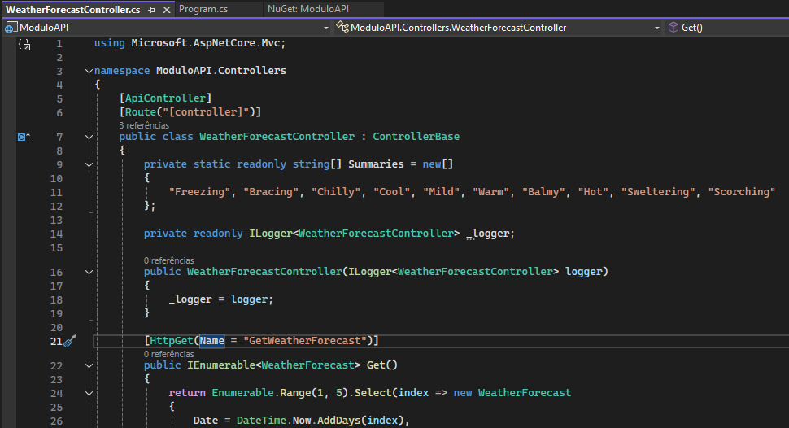

Executando este código, será aberto uma página web no navegador em localhost com um front-end em swagger com uma breve documentação do que esta API faz.

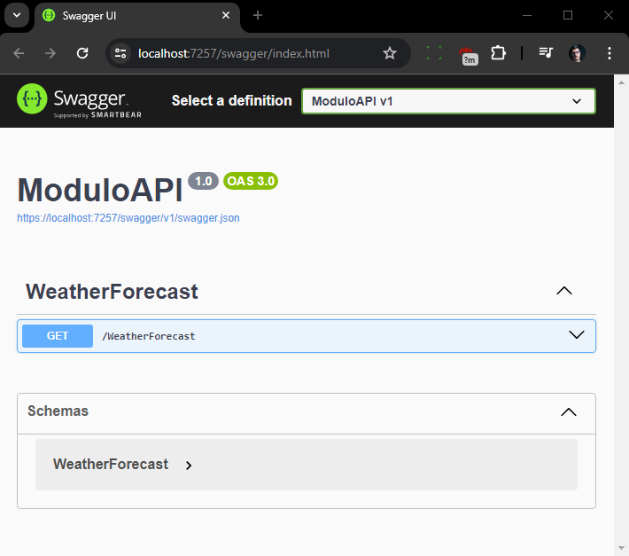
Nem toda API possui um Swagger. Ele facilita muito na documentação quando está ligado a API, mas nem sempre o teremos como padrão em todos os projetos.
__*APIs não têm interface pois trabalham diretamente com dados, então seus retornos são sempre dados processados em algum banco ou em qualquer aplicação back-end.*__

#### Controllers

APIs trabalham com requisições HTTP e as controllers são classes responsáveis por agrupar suas requisições HTTP e disponibilizar os seus Endpoints.

##### Criando um Controlador Vazio

1. Clicando com o botão direito do mouse em __Controllers__
2. Navegue até adicionar e clique em __Controlador__
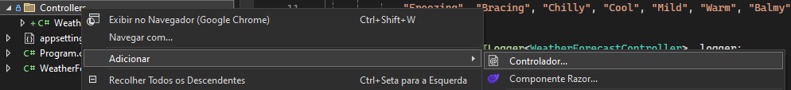
3. Selecione __Comum__, __API__ e __Controlador API - Vazio__
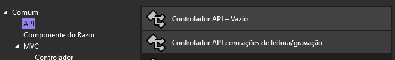
4. Dê um nome ao seu controlador e clique em adicionar
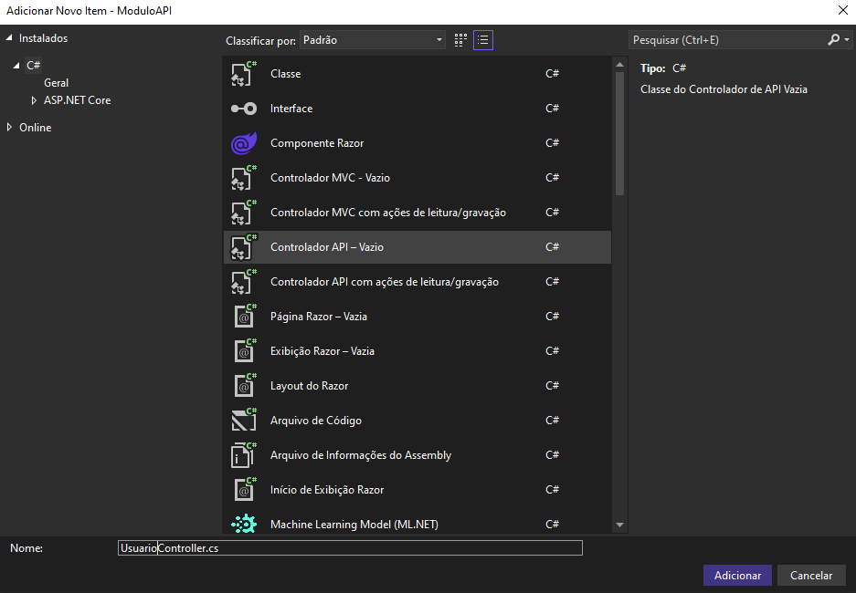
5. Será criado um controlador vázio com as configurações básicas que um controlador precisa para funcionar
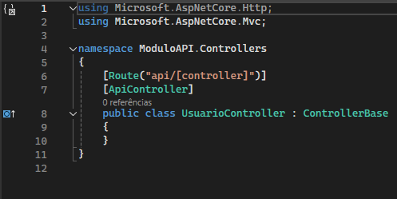
Tal controlador ainda não faz nada, precisamos implementar um código para que ele faça alguma coisa.

##### Criando Método que retorna Data e Hora
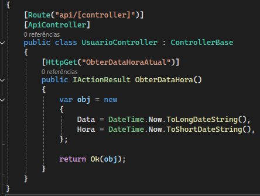
No código acima criamos um método `IActionResult`(Interface Action Result) chamado `ObterDataHora()` que retorna um objeto anônimo em `return Ok(obj)`.
A linha `[HttpGet("ObterDataHoraAtual")]` é responsável por guardar o nome de como este método poderá ser chamado pela minha API.

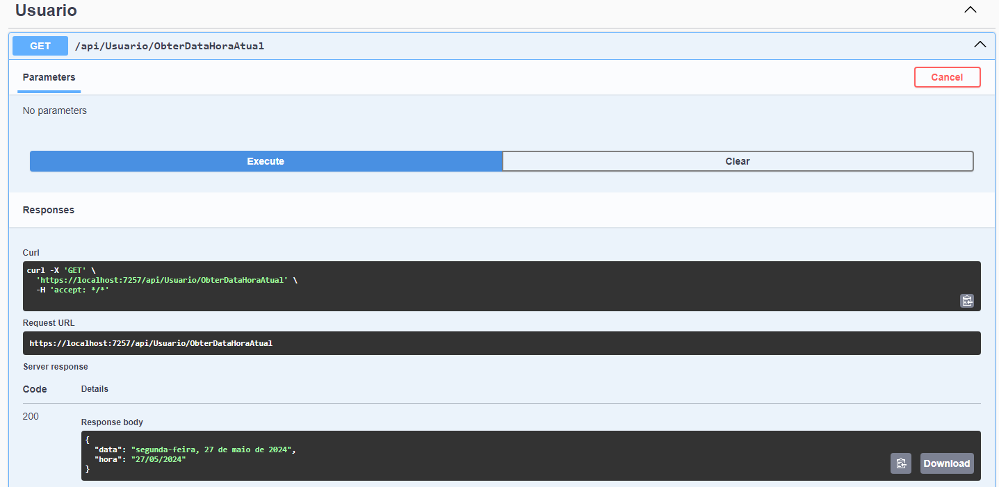
Note que se rodarmos a API no Swagger novamente, teremos agora a sessão `Usuario` funcionando conforme o código que escrevemos acima. Conforme está dentro do projeto, a pasta Controllers é onde ficam guardados os caminhos e sempre que criamos um novo controller o swagger o reconhece automaticamente.

##### Endpoint com parâmetro

Podemos criar Endpoints com parâmetros que recebem valores a serem tratados dentro de nossa API.

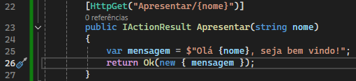
No exemplo acima escrevemos uma função `Apresentar`  que recebe uma string como parâmetro. No nome de chamada `[HttpGet("Apresentar/{nome}")]` da API fica definido entre `{}` onde este parâmetro será colocado no momento em que a função é chamada pela API.

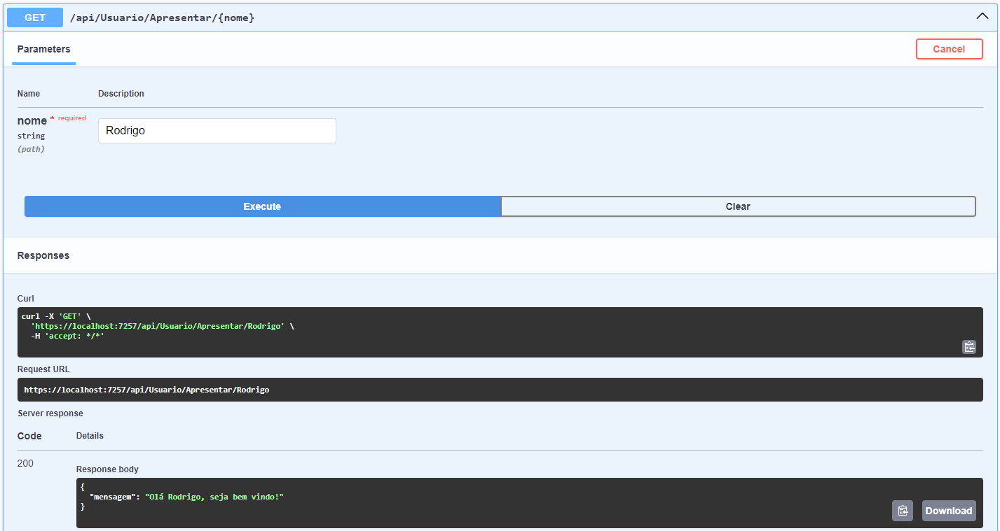
Se voltarmos ao swagger teremos agora o método `Apresentar/{nome}` exige que um nome seja passado para que a requisição seja feita.

### Entity Framework e CRUD
O Entity Framework(EF) é um framework ORM(Object-Relational Mapping) criado para facilitar a integração com o banco de dados, mapeando tabelas e gerando comando SQL de forma automática.

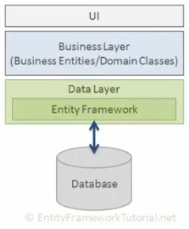
Quando vamos escrever um código que faz um processamento no banco de dados, precisamos sempre saber a linguagem do banco e também escrever  cada query manualmente, pois o C# não sabe em qual linguagem aquele banco foi escrito.
Para temos o Entity framework que automatiza essas consultas e inserções no banco de dados, sem que precisemos escrever uma única query em  SQL.

#### Entendendo o CRUD
Um CRUD é um acrônimo para as consultas mais comuns presentes na maioria dos bancos de dados.

| CRUD | Comando |
|-|-|
| C | CREATE (Insert) |
| R | READ (Select) |
| U | UPDATE (Update) |
| D | DELETE (Delete) |

Essas quatro operações sempre estarão presentes na maioria dos bancos de dados, portanto é muito comum se ver artigos e tutoriais de CRUD de C# com SQL server por exemplo.

#### Instalando o Entity Framework

1. No terminal da sua IDE, digite `dotnet tool install --global dotnet-ef`
2. No gerenciador de pacotes NuGet, procure por `Microsoft.EntityFrameworkCore.Design`
3. Selecione o projeto que o pacote será instalado e clique em instalar
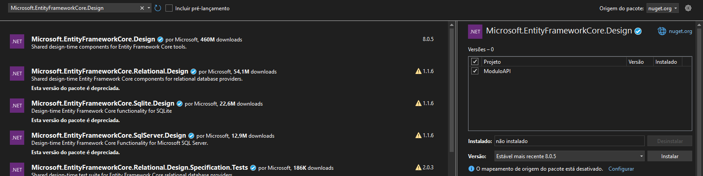
4. Procure novamente por `Microsoft.EntityFrameworkCore.SQLServer`
5. Selecione o projeto novamente e instale o pacote
__*Fique atento a versão do .NET que está utilizando, pode ser necessária a utilização de outra versão do pacote compatível com a versão do seu .NET*__

A ferramenta que instalamos no __*Passo 1*__ somente é necessário instalar uma vez, já o pacote deve ser instalado em todo projeto do qual queremos utilizar o Entity Framework.
Para cada banco que dados que estamos trabalhando, teremos um pacote diferente. No nosso caso estamos utilizando o Microsoft SQL Server.

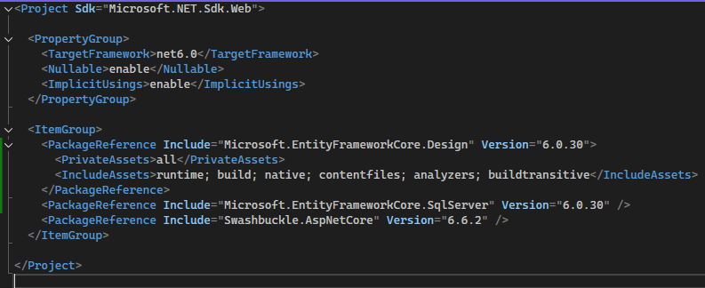
Podemos conferir se os pacotes foram instalados corretamente no arquivo .cjproj do projeto.

#### Criando a classe entidade

Vamos criar uma pasta no nosso projeto chamada `Entities` que indica que tudo dentro dela se refere a uma tabela do nosso banco de dados.

Criamos uma classe `Contato` nesta pasta que servirá como um espelho para criação de uma tabela no banco de dados.
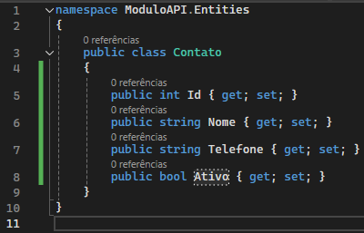

#### Criando Contexto

Vamos criar uma pasta no nosso projeto chamada `Context` onde estarão nossas classes que centralizam nossas informações em determinado banco de dados.
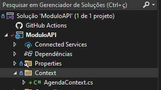

Criamos uma classe `AgendaContext` é onde faremos o contexto de configuração com o banco de dados utilizando o Entity Framework.
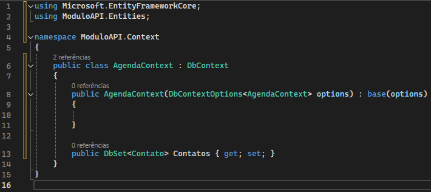
Nesta classe herdamos a classe `DbContext` do EF, definimos um contrutor com parâmetro `DbContextOptions<AgendaContext> options` onde receberá nossa conexão com o banco e será passado pelo `base(options)` herdado para o nosso `DbContext`.
Por fim definimos uma propriedade que se refere a nossa entidade `Contato` por meio de um `DbSet`, onde será referenciado a criação da nossa tabela no banco de dados.

#### Configurando Conexão

Dentro do nosso projeto temos dois arquivos JSON chamados `appsettings.json` e `appsettings.Development.json`.
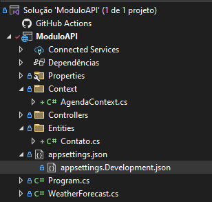
A principal diferença entre esses dois arquivos é que o `appsettings.json` define configurações para ambiente de produção, portanto toda configuração feita neste arquivo será levada para o deploy da sua API.
Já o arquivo `appsettings.Development.json` define configurações para ambiente de desenvolvimento, onde temos configurações referentes a este contexto.

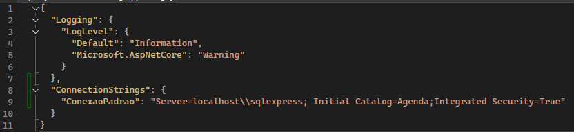
No nosso arquivo `appsettings.Development.json` vamos criar uma nova chave `ConnectionStrings`, dentro dela criaremos uma chave `ConexaoPadrao` fazendo referencia ao banco de dados SQL Express que criamos anteriormente.
__*Lembre-se de verificar se o banco de dados está operando no SQL Server Configuration Manager*__
Em `Server=` colocamos o endereço do banco de dados que será acessado pela nossa API.
Em `Initial Catalog=` definimos qual será a nossa tabela do banco de dados. *Esta ainda não foi criada, mas ficará a cargo do EF cria-la em nosso banco.*
Em `Integrated Security=` definimos nossa autenticação, que neste caso é a nossa autenticação integrada do windows mesmo.
__*Esta configuração serve para o SQL Server Express, caso esteja utilizando outro banco de dados, será outra configuração diferente.*__

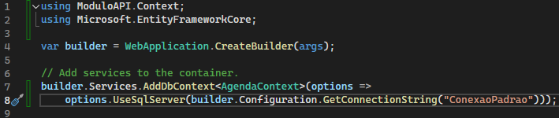
Em nosso arquivo `Program.cs` vamos configurar nosso contexto e o EF nas linhas 1 e 2.
Na linha 7 e 8 definimos nosso `builder.Services.AddDbContext` passando para ele a nossa `AgendaContext`.
Nos parâmetros definimos as opções utilizando `.UseSqlServer()` para definir que utilizamos o SQL Server e como parâmetro dela utilizamos nossa conexão com o banco de dados escrita lá no nosso arquivo `appsettings.Development.json` por meio do método `GetConnectionString()`.

#### Migrations

O EF gera os comandos SQL de maneira dinâmica, porém, os comandos de criação de tabelas precisam ser feitos de maneira manual. Não necessáriamente você precisará escrever os comandos em SQL, mas precisamos dizer para o EF que as alterações no nosso código precisam ser refletidas no banco de dados.
Conforme criamos anteriormente o contexto `AgendaContext.cs`, tudo que estiver como `DbSet<>` será transformado em uma tabela no banco de dados.
As migrations servem para mapear nossas classes e transformá-las em tabelas no banco de dados.

##### Criando uma migration

__*Certifique-se primeiramente que seu banco de dados esteja rodando.*__

1. No terminal da sua IDE digite `dotnet-ef migrations add CriacaoTabelaContato`
*O nome após o `add` pode ser o nome que Desejar*
2. Pressione enter e note que foi criado um novo diretório `Migrations` dentro do projeto
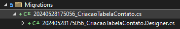

Os arquivos criados no diretório `Migrations` são os comandos SQL gerados automaticamente pelo EF.
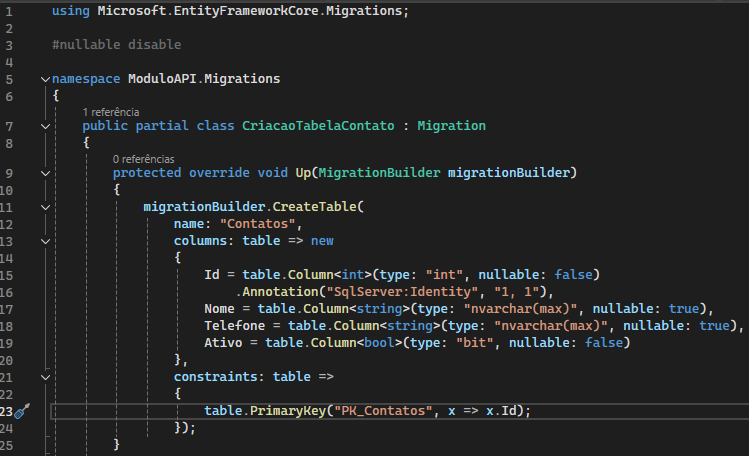
Note que dentro do arquivo principal temos um método `Up()` responsável pela criação da tabela. Podemos observar que o EF identificou nossa classe `Contato.cs`, relacionou suas propriedades com os respectivos tipos no banco de dados e podemos notar que seu `name: ` está no plural, pois o EF identifica que uma tabela no banco de dados sempre receberá mais de um dado.

Também no mesmo arquivo temos um método `Down()` que é responsável por deletar a tabela do banco de dados.

##### Aplicando uma migration

__*Certifique-se primeiramente que seu banco de dados esteja rodando.*__

1. No terminal de sua IDE Digite `dotnet-ef database update`
2. Pressione enter e note que foram executados uma série de comandos no console
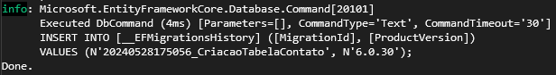

Após estes passos será criada uma tabela no nosso banco de dados.
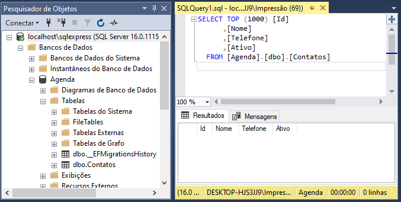
No SQL Server Management Studio podemos observar que foi criado um novo banco `Agenda` e uma tabela `Contatos` no banco de dados, conforme criado em nosso código C# sem que fosse necessário escrever uma única linha de código em SQL.

#### Criando uma Controller e o Endpoint de Create

Vamos criar uma nova classe controller para adicionar contatos na nossa tabela.

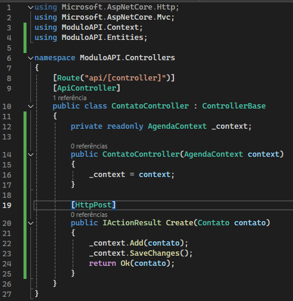
No código acima temos uma classe controller que possui um contexto privado `private reandonly AgendaContext _context;`, que por um contrutor recebe o contexto do tipo `AgendaContext`.
Criamos um método `Create()` que recebe um parâmetro do tipo `Contato` definido pela nossa entidade.
Tal método faz um `.Add()` recebendo um contato como parâmetro, salva as alterações com `.SaveChanges()` e retorna o contato em `Ok(contato)`.
Por fim definimos o controlador como `[HttpPost]`, pois este faz uma alteração no banco de dados ao invés de trazer dados dele.

Feito isso, se rodarmos nossa API lá no swagger, podemos notar que temos um novo método.
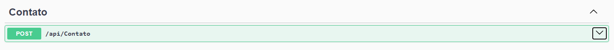
Note que diferente dos controllers definidos anteriormente, este novo controller está na cor verde e é do tipo POST.

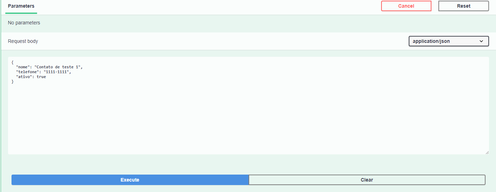
Ao clicar em Try Out, o swagger vai nos mostrar um campo em formato JSON para que possamos preencher com as informações que definimos na nossa entidade `Contato.cs`. *Podemos omitir o id pois se trata de uma chave primária.*

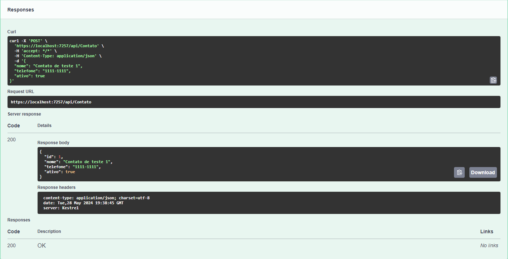
Clicando em execute teremos as responses da nossa API confirmando que os dados foram gravados no banco de dados pelo EF.

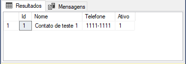
Ao fazer um SELECT no banco de dados vamos encontrar nosso contato adicionado com sucesso pelo EF.

##### Alterando o endpoint Create

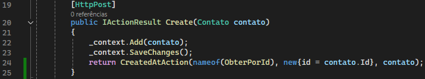
Podemos mudar o tipo de retorno do endpoint create para que ele nos retorne o id criado no momento em que inserimos um novo contato no banco de dados.

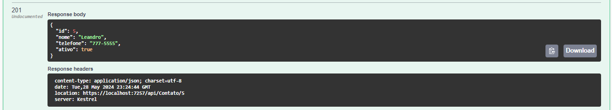
Ao criar um novo contato com nosso endpoint, ele nos retorna um `https://localhost:7257/api/Contato/5` para que possamos acessar diretamente o contato criado.

#### Criando um endpoint de Select por ID

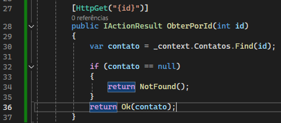
Dentro do `ContatoController.cs` escrevemos o método `ObterPorId(int id)` conforme podemos ver na imagem acima. Tal método recebe um id e retorna por meio do `_context.Contatos.Find(id)` o nosso contato salvo no banco de dados. Fizemos também uma validação para caso seja solicitado um id inválido, ele retornará `NotFound()`.

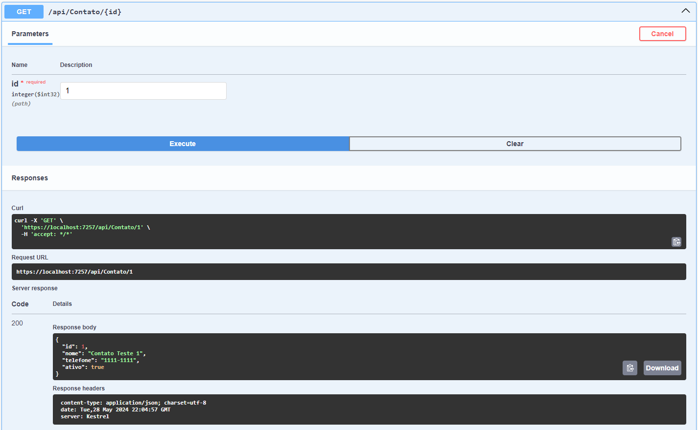
Se voltarmos ao swagger teremos mais um endpoint GET agora para obter o contato do banco de dados por meio do ID.

#### Criando um endpoint de Update

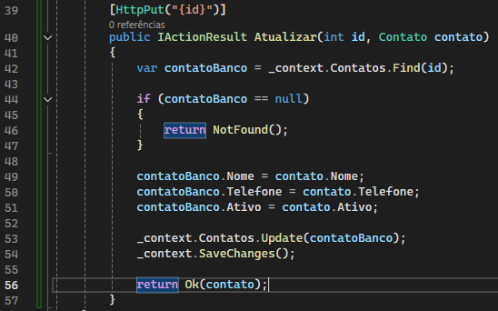
No código acima temos um endpoint `Atualizar(int id, Contato contato)` recebendo o id que será modificado e um JSON com as informações a serem atualizadas.
O EF vai procurar o id fornecido no banco de dados e armazena-lo na variável `contatoBanco`.
Nas linhas 49 a 51 o contato que o EF trouxe do banco recebe as novas informações fornecidas para o método.
Assim como no endpoint select que fizemos anteriormente, faremos um `.Update()` e um `.SaveChanges()`, por fim retornando um `Ok()`.

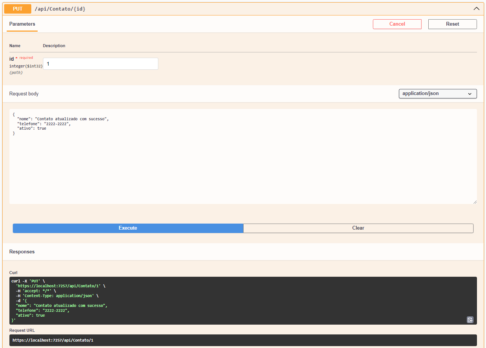
Voltando ao swagger teremos agora um novo endpoint PUT que nos solicita o id e possui um request body com o JSON que será a modificação que desejamos fazer no banco de dados.

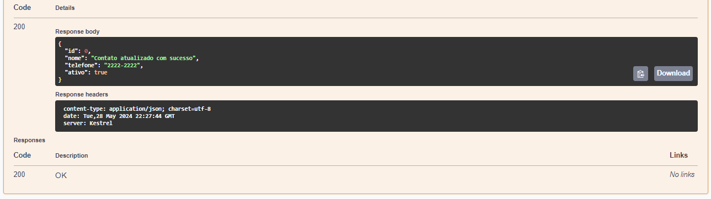
Ao executarmos teremos o response body indicando nossa alteração no banco de dados. Também podemos executar o endpoint de select escrito anteriormente para consultar esta mudança no banco de dados.

#### Criando um endpoint de Delete

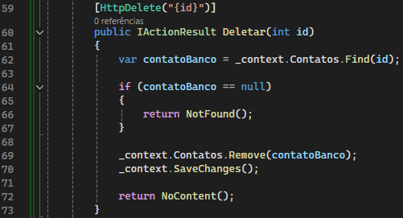
No código acima temos o método `Deletar(int id)` que recebe o id do banco e reaproveitamos aquela mesma validação para verificar se o id existe no banco.
Utilizamos na linha 69 o método `Remove()` passando como parâmetro o `contatoBanco` e salvamos as alterações na linha 70.
Por fim retornamos um `NoContent()` que indica que não temos conteúdo.

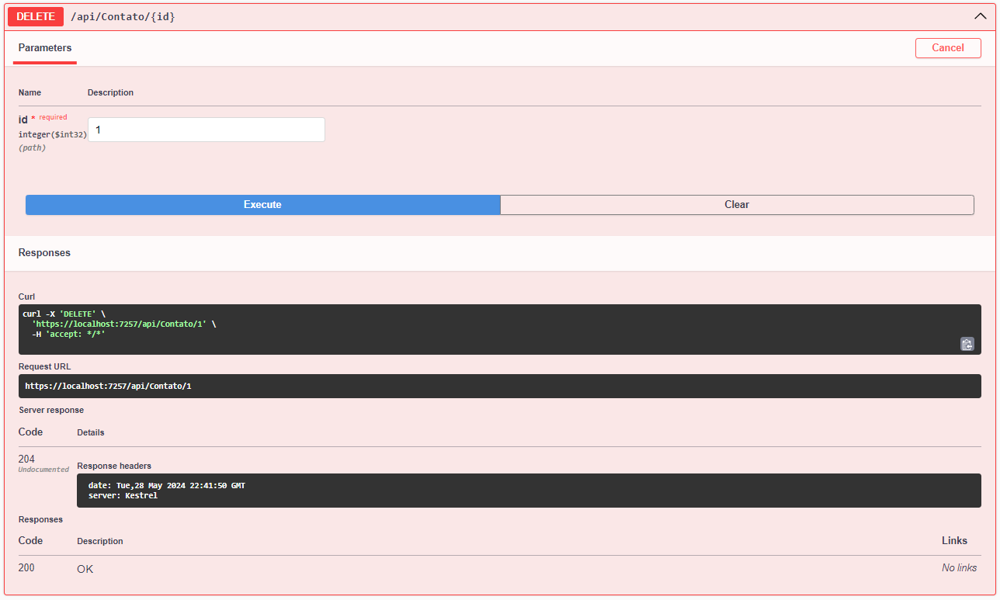
Ao retornarmos ao swagger teremos o novo endpoint DELETE que possui uma requisição de id para deletar a informação do banco de dados. Como definimos no cotroller, esta operação não retorna nenhum conteúdo mas a operação foi feita com sucesso.

#### Incrementando o enpoint Select por nome

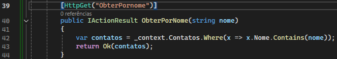
No código acima temos o método `ObterPornome(string nome)` recebendo uma string que pode ser o nome completo ou apenas uma letra.
Ao invés do método `.Find()` que utilizamos no método `ObterPorid()`, aqui utilizamos o método `Where()` recebendo como parâmetro `x => x.Nome.Contains(nome)`, pois dessa forma se conter o nome completo ou apenas uma letra será retornado tudo o que corresponder a `nome` dentro do banco de dados.

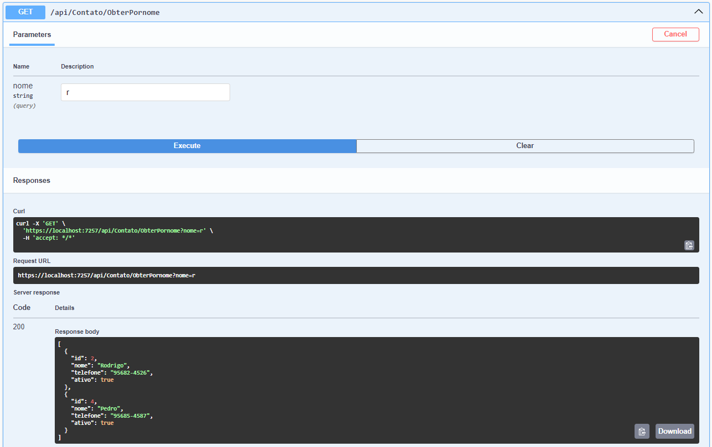
Retornando ao swagger teremos um novo endpoint GET que requer agora uma string nome e como podemos observar, ao digitar apenas `r` ele retorna 2 contatos pois ambos atendem a string passada para o endpoint.

### Verbos HTTP

Os verbos HTTP estão relacionados ás ações da sua API no banco de dados.

| Verbo HTTP | Operação CRUD | Descrição                         |
|------------|---------------|-----------------------------------|
| GET        | Read          | Recuperar recursos                |
| POST       | Create        | Criar um novo recurso             |
| PUT        | Update/Replace| Atualizar um recurso existente    |
| PATCH      | Update/Modify | Atualizar parcialmente um recurso |
| DELETE     | Delete        | Deletar um recurso                |
