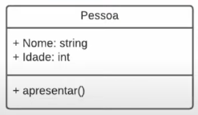
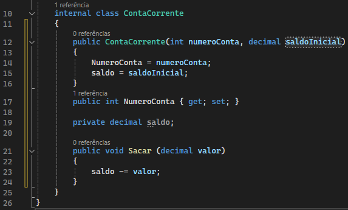
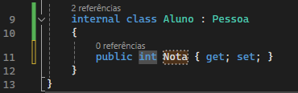
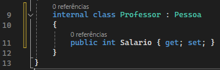
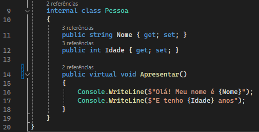
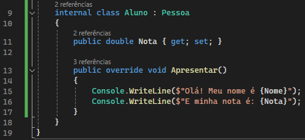
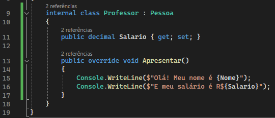
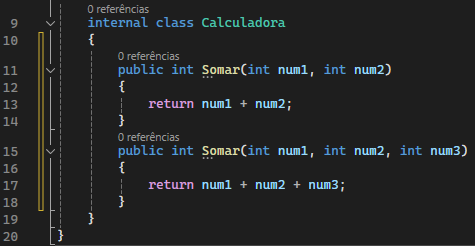
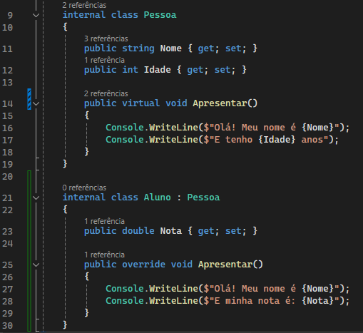

# Programação Orientada a Objeto

---

## Paradigma de Programação Orientada a Objeto (POO)

A POO é um paradigma de programação, ou seja, corresponde a uma técnica de programação para um fim específico. Consiste em extrair características do mundo real para compor as propriedades deste objeto.

Existem quatro pilares dentro desta técnica:
* Abstração
* Encapsulamento
* Herança
* Polimorfismo

Alguns outros paradigmas:
* Programação estruturada
* Programação imperativa
* Programação procedural
* Programação orientada a eventos
* Programação lógica

### Abstração
A abstração consiste em extrair características de um objeto do mundo real e abstrair para um contexto específico, considenrando apenas os atributos importantes.

Aqui temos um exemplo de uma classe `Pessoa`. Neste contexto apenas precisamos de duas características `Nome: string` e `Idade: int`, além do método `Apresentar()` que abstrai uma ação que este objeto faz.
Mesmo que uma pessoa tenha mais características que somente estes, mas para o nosso sistema no contexto atual, precisamos apenas destas.

### Encapsulamento
O encapsulamento serve para proteger uma classe e definir limites para alteração de suas propriedades.

Serve para ocultar seu comportamento e expor somente o necessário.

No exemplo acima, temos uma classe `ContaCorrente` que possui duas propriedades `NumeroConta` e `saldo`. Podemos observar que a propriedade `saldo` está como private, isso a torna bloqueada para alterações fora da classe, ou seja, encapsulada pela classe e somente ela pode alterar esta propriedade.
Neste caso a classe disponibiliza o método `Sacar()` para que seja possível fazer a alteração do saldo.

### Herança
A herança nos permite reutilizar atributos, métodos e comportamentos de uma classe em outras classes.

Serve para agrupar objetos que são do mesmo tipo, porém com características diferentes.

Vamos imaginar que em um sistema de escola precisamos fazer o cadastro de alunos e professores, devemos então declarar duas classes `Aluno` e `Professor`. Ambas as classes possuem a propriedade `Nome`, `Idade` e o método `Apresentar()`, mas não faz sentido algum escrever novamente essas propriedades, pois o que difere essas duas classes é apenas a propriedade `Nota` ou `Salario`.

Para que uma classe utilize como herança uma outra classe, ela deve ser declarada após o nome da classe com ` : Pessoa`, para que esta classe passe a incorporar propriedades e comportamentos da classe definida.
Em C# uma classe pode somente herdar uma classe por vez.

### Polimorfismo
O polimorfismo vem do grego e significa "muitas formas".

Com o polimorfismo, podemos sobrescrever métodos das classes filhas para que se comportem de maneira diferente e ter sua própria implementação.

#### Preparando o Polimorfismo

Para que seja possível sobrescrever um método, precisamos primeiro definir o método como `virtual` em suas definições logo após o `public`. Desta forma estamos sinalizando que este método pode ser sobrescrito caso o desenvolvedor assim quiser.

#### Sobrescrevendo método

Da mesma forma que declaramos um método comum, agora apenas adicionamos a palavra reservada `override`, que por sua vez vai sobrescrever o método de sua classe pai `Pessoa` e terá o comportamento agora definido na classe `Aluno`.

Na classe `Professor` temos o mesmo exemplo de polimorfismo. Neste caso as classes têm o mesmo pai, mas têm métodos diferentes específicos de cada classe.

#### Polimorfismo em tempo de compilação
Consiste em ter um método com nomes iguais, porém, com números de parâmetros diferentes e que não depende de herança.

__Overload ou Early Binding__

#### Polimorfismo em tempo de execução
Consiste em sobrescrever métodos existentes em classes pai. Este depende de herança.

__Override/Late Binding__