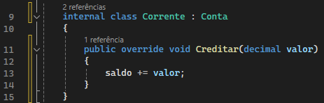
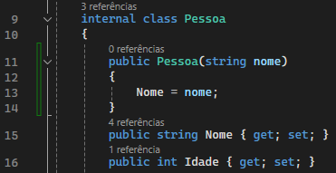
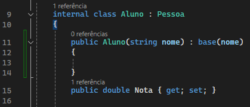
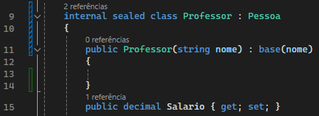
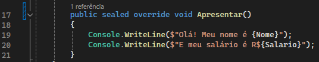
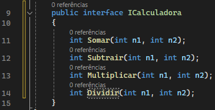
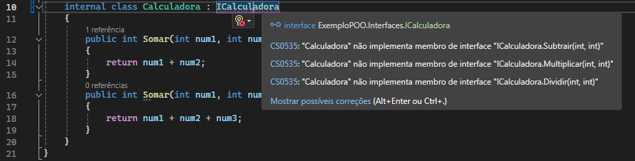
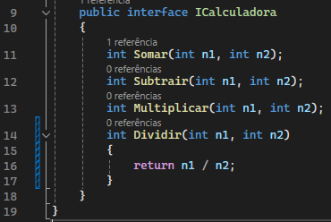

<!-- TOC start (generated with https://github.com/derlin/bitdowntoc) -->

- [Programação Orientada a Objeto](#programação-orientada-a-objeto)
   * [Paradigma de Programação Orientada a Objeto (POO)](#paradigma-de-programação-orientada-a-objeto-poo)
      + [Abstração](#abstração)
      + [Encapsulamento](#encapsulamento)
      + [Herança](#herança)
      + [Polimorfismo](#polimorfismo)
         - [Preparando o Polimorfismo](#preparando-o-polimorfismo)
         - [Sobrescrevendo método](#sobrescrevendo-método)
         - [Polimorfismo em tempo de compilação](#polimorfismo-em-tempo-de-compilação)
         - [Polimorfismo em tempo de execução](#polimorfismo-em-tempo-de-execução)
   * [Classe abstrata](#classe-abstrata)
      + [Sobrescrevendo método](#sobrescrevendo-método-1)
      + [Construtor por herança](#construtor-por-herança)
   * [Classe Selada](#classe-selada)
   * [Classe object](#classe-object)
      + [Métodos](#métodos)
         - [Tabela de métodos da classe object](#tabela-de-métodos-da-classe-object)
   * [Interfaces](#interfaces)
      + [Declarando interface](#declarando-interface)
      + [Implementando interface](#implementando-interface)
      + [Método padrão na interface](#método-padrão-na-interface)

<!-- TOC end -->

# Programação Orientada a Objeto

---

## Paradigma de Programação Orientada a Objeto (POO)

A POO é um paradigma de programação, ou seja, corresponde a uma técnica de programação para um fim específico. Consiste em extrair características do mundo real para compor as propriedades deste objeto.

Existem quatro pilares dentro desta técnica:
* Abstração
* Encapsulamento
* Herança
* Polimorfismo

Alguns outros paradigmas:
* Programação estruturada
* Programação imperativa
* Programação procedural
* Programação orientada a eventos
* Programação lógica

### Abstração
A abstração consiste em extrair características de um objeto do mundo real e abstrair para um contexto específico, considenrando apenas os atributos importantes.

Aqui temos um exemplo de uma classe `Pessoa`. Neste contexto apenas precisamos de duas características `Nome: string` e `Idade: int`, além do método `Apresentar()` que abstrai uma ação que este objeto faz.
Mesmo que uma pessoa tenha mais características que somente estes, mas para o nosso sistema no contexto atual, precisamos apenas destas.

### Encapsulamento
O encapsulamento serve para proteger uma classe e definir limites para alteração de suas propriedades.

Serve para ocultar seu comportamento e expor somente o necessário.

No exemplo acima, temos uma classe `ContaCorrente` que possui duas propriedades `NumeroConta` e `saldo`. Podemos observar que a propriedade `saldo` está como private, isso a torna bloqueada para alterações fora da classe, ou seja, encapsulada pela classe e somente ela pode alterar esta propriedade.
Neste caso a classe disponibiliza o método `Sacar()` para que seja possível fazer a alteração do saldo.

### Herança
A herança nos permite reutilizar atributos, métodos e comportamentos de uma classe em outras classes.

Serve para agrupar objetos que são do mesmo tipo, porém com características diferentes.

Vamos imaginar que em um sistema de escola precisamos fazer o cadastro de alunos e professores, devemos então declarar duas classes `Aluno` e `Professor`. Ambas as classes possuem a propriedade `Nome`, `Idade` e o método `Apresentar()`, mas não faz sentido algum escrever novamente essas propriedades, pois o que difere essas duas classes é apenas a propriedade `Nota` ou `Salario`.

Para que uma classe utilize como herança uma outra classe, ela deve ser declarada após o nome da classe com ` : Pessoa`, para que esta classe passe a incorporar propriedades e comportamentos da classe definida.
Em C# uma classe pode somente herdar uma classe por vez.

### Polimorfismo
O polimorfismo vem do grego e significa "muitas formas".

Com o polimorfismo, podemos sobrescrever métodos das classes filhas para que se comportem de maneira diferente e ter sua própria implementação.

#### Preparando o Polimorfismo

Para que seja possível sobrescrever um método, precisamos primeiro definir o método como `virtual` em suas definições logo após o `public`. Desta forma estamos sinalizando que este método pode ser sobrescrito caso o desenvolvedor assim quiser.

#### Sobrescrevendo método

Da mesma forma que declaramos um método comum, agora apenas adicionamos a palavra reservada `override`, que por sua vez vai sobrescrever o método de sua classe pai `Pessoa` e terá o comportamento agora definido na classe `Aluno`.

Na classe `Professor` temos o mesmo exemplo de polimorfismo. Neste caso as classes têm o mesmo pai, mas têm métodos diferentes específicos de cada classe.

#### Polimorfismo em tempo de compilação
Consiste em ter um método com nomes iguais, porém, com números de parâmetros diferentes e que não depende de herança.

__Overload ou Early Binding__

#### Polimorfismo em tempo de execução
Consiste em sobrescrever métodos existentes em classes pai. Este depende de herança.

__Override/Late Binding__

---

## Classe abstrata
Uma classe abstrata tem como objetivo ser exclusivamente um modelo para ser herdado, portanto não pode ser instanciada.

Você pode implementar métodos ou deixá-los a cargo de quem herdar.

Podemos notar que diferente de uma classe comum, a classe abstrata utiliza a palavra reservada `abstract`, o que a torna uma classe que somente pode ser herdada e jamais poderá ser instanciada diretamente.
O mesmo acontece com o método `Creditar()`. Podemos notar que o método não possui corpo, pois o mesmo deverá ser implementado pela classe filha da qual herdará este método.

### Sobrescrevendo método

Como declarado na classe pai, o método `Creditar()` deve obrigatóriamente ser implementado pela classe filha.
Por conta do modificador de acesso `protected` declarado na classe pai, a propriedade `saldo` pode ser modificada pela classe `Corrente`, funcionando de forma parecida que o modificador `private` mas permitindo que classes filha possam alterar tais atributos.

### Construtor por herança
Quando uma classe possui um construtor este passa a ser obrigatório para as classes filhas, fazendo com que ele precise ser declarado no código das classes filhas.

No exemplo acima temos o construtor para que `nome` seja uma propriedade obrigatória na instanciação da classe pessoa.

A classe `Aluno` é uma classe filha de `Pessoa` então para isso ela deve possuir um construtor para que `nome` seja atribuido como propriedade.
Utilizamos `Aluno(string nome) : base(nome)` para que todo o código do construtor da classe pai seja atribuido a classe filha, neste caso, o código `Nome = nome` da classe `Pessoa` passará a ser o comportamento da classe filha.

## Classe Selada

Ao contrário da classe abstrata uma classe selada não pode ser herdada por outras classes, portanto, uma vez definida uma classe selada nenhuma outra classe pode ser filha.
O mesmo também pode ocorrer para métodos. Um método selado não pode ser sobrescrito por classes filhas.

No exemplo acima, temos a palavra reservada `sealed` que define que esta classe não pode ser herdada por outras classes.
Utilizamos este modificador de acesso quando esta for a instancia final da classe.

O mesmo pode ser feito em métodos, definindo o mesmo comportamento de uma classe selada.

---

## Classe object

A classe System.Object é a mãe de todas as classes na hierarquia do .NET.
Todas as classes derivam, direta ou indiretamente da classe Object, e ela tem como objetivo prover serviços de baixo nível para suas classes filhas.

### Métodos
A classe object por servir como base para todas as classes carrega junto com ela métodos que todo objeto instanciado vai possuir por padrão.

#### Tabela de métodos da classe object

| Métodos | Descrição |
| --- | --- |
| Equals(Object) | Determina se o objeto especificado é igual ao objeto atual. |
| Equals(Object, Object) | Determina se as instâncias de objeto especificadas são consideradas iguais. |
| Finalize() | Permite que um objeto tente liberar recursos e executar outras operações de limpeza antes de ser recuperado pela coleta de lixo.
| GetHashCode() | Serve como função de hash padrão. |
| GetType() | Obtem o Type da instância atual |
| MemberwiseClone() | Cria uma cópia superficial do Object atual. |
| ReferenceEquals(Object, Object) | Determina se as instâncias de Object especificadas são a mesma instância. |
| ToString() | Retorna uma cadeia de caracteres que representa o objeto atual. |

---

## Interfaces
Uma interface é um contrato que pode ser implementado por uma classe.
É como se fosse uma classe abstrata, podendo definir métodos abstratos para serem implementados.
Assim como uma classe abstrata, uma interface não pode ser instanciada.

### Declarando interface

No exemplo acima temos uma interface de calculadora.
Por convenção, todo nome de classe começa com a letra "I".
A partir desta interface, classes que herdarem esta interface deverão implementar seus métodos.

### Implementando interface

Note que ao declarar a herança, é apresentado um erro que obriga que sejam implementados os métodos declarados na interface. No caso do método `Somar()` já temos ele implementado então não ocorre erro.

Clicando na lampada, podemos selecionar a opção `Implementar a interface` para que a IDE automaticamente implemente os métodos da interface, sendo necessário apenas a escrita do código facilitando o desenvolvimento.

### Método padrão na interface

Quando implementamos um método dentro da interface, temos então um método padrão, que caso não seja implementado ao ser declarada a herança, será implementado o método escrito na interface.
